# SIPDL — Technical Architecture & Reverse-Engineering Report
### Sistem Informasi Peserta Didik Longitudinal

> **Scope:** Read-only architectural analysis derived from `app/Models/`, `database/migrations/`, `database/seeders/RolePermissionSeeder.php`, `app/Filament/Resources/`, `app/Observers/`, `app/Services/`, and `app/Http/Controllers/`. No application code was modified.

---

## 1. Actor & Use Case Analysis

### 1.1 Actor Identification

Actors are defined by the `role` enum in the `users` table (`admin, headmaster, teacher, student, guardian`) and the **Spatie Roles** seeded in `database/seeders/RolePermissionSeeder.php`: `super_admin, admin, teacher, headmaster, student, guardian, guru_bk`. Access control is enforced via three layers:

- `User::canAccessPanel()` → only `is_active = true` users can log in (`app/Models/User.php:80`).
- Filament Shield permissions (`view_any_*`, `create_*`, etc.).
- Resource-level `shouldRegisterNavigation()` / `getEloquentQuery()` scoping (e.g., a teacher only sees their own homeroom in `app/Filament/Resources/RaporResource.php:35`).

| # | Actor | System Role(s) | Scope |
|---|-------|----------------|-------|
| A1 | **Super Admin** | `super_admin` | Full access via Gate intercept (all permissions auto-granted) |
| A2 | **Admin / Tata Usaha** | `admin` | Master data CRUD, user credentials, promotion, grade override |
| A3 | **Kepala Sekolah (Headmaster)** | `headmaster` | Read-only monitoring across all academic data |
| A4 | **Guru / Teacher** | `teacher` | KBM, assessments, grading; + homeroom duties when assigned as Wali Kelas |
| A5 | **Guru BK (Counselor)** | `guru_bk` | VAK questionnaires, counseling records, learning-style analysis |
| A6 | **Siswa (Student)** | `student` | Self report card (shadow), schedule, VAK questionnaire |
| A7 | **Wali Siswa (Guardian)** | `guardian` | Child's report card, schedule, learning-style results |

> A teacher gains a contextual sub-actor role **"Wali Kelas" (Homeroom Teacher)** only when a `class_homerooms` row links them to a class in the active period.

### 1.2 Use Case Table

| Actor | Use Case | Description | Pre-condition |
|-------|----------|-------------|---------------|
| **Super Admin** | Manage Roles & Permissions | Configure Spatie roles/permissions, intercept all gates | Authenticated, `super_admin` |
| **Super Admin** | All Admin/Teacher use cases | Inherits every capability | `is_active = true` |
| **Admin** | Manage User Credentials | CRUD `users` (student/guardian/teacher accounts) | `view_any_user` + active |
| **Admin** | Manage Academic Periods | CRUD `academic_periods`, set active period | `create_academic::period` |
| **Admin** | Manage Master Data | CRUD classrooms, subjects, teachers, students | `*_classroom/subject/teacher/student` |
| **Admin** | Manage Teaching Assignments | CRUD SK Mengajar (teacher↔subject↔class) | `*_teaching::assignment` |
| **Admin** | Override Final Grade | Manually set `final_score` (`is_manual_override=true`) | `super_admin`/`admin` (`FinalGradesRelationManager.php:19`) |
| **Admin** | Lock / Unlock Report Grades | Toggle `is_locked` on `final_grades` | `super_admin`/`admin` |
| **Admin** | Run Promotion Wizard | Promote/retain students across periods | `page_StudentPromotionWizard` |
| **Headmaster** | Monitor Academic Data | Read-only view of all entities & reports | `view_*` (no create/update) |
| **Headmaster** | Lock All Grades | Finalize report grades for printing | `headmaster` role (`ViewRapor.php:335`) |
| **Teacher** | Manage Learning Objectives (TP) | CRUD `learning_objectives` per subject/phase | `*_learning::objective` |
| **Teacher** | Record KBM Journal | CRUD `lesson_journals` & attendance | `*_lesson::journal` |
| **Teacher** | Plan Assessment | Create assessments (formatif/sumatif) + weights | `update_teaching::assignment` |
| **Teacher** | Input Grades (Bulk) | Enter scores per student per assessment | Owns the TeachingAssignment |
| **Teacher** | Input / Calibrate Remedial | Re-score students below KKTP, preserve original | Grade exists below KKTP |
| **Teacher** | Grade Kokurikuler (P5) | Narrative project assessment | `*_kokurikuler::grade` |
| **Teacher** | Grade Extracurricular | Predicate + narrative for enrolled students | `update_student::subject::enrollment` |
| **Wali Kelas** | Input Homeroom Notes & Attendance | Fill `student_reports` per student | Teacher is `is_current` homeroom |
| **Wali Kelas** | Generate Narratives | Auto-build `narrative_description` for all | Active homeroom |
| **Wali Kelas / Admin** | Print / Export Report | Native HTML print, PDF, Word | `view_rapor` |
| **Guru BK** | Manage VAK Questionnaire | CRUD questionnaire, publish, target classes | `*_bk::questionnaire` |
| **Guru BK** | Evaluate Learning Style | Score responses, set `dominant_style` (V/A/K) | Response `completed` |
| **Guru BK** | Manage Counseling Records | CRUD `bk_counseling_records` + visibility flags | `*_bk::counseling::record` |
| **Student** | View Own Report (Shadow) | Unofficial report card (`isOfficial=false`) | `view_rapor`, NISN match |
| **Student** | Fill VAK Questionnaire | Submit answers when ticket open | `page_MyQuestionnaires` |
| **Student** | View Schedule | See active class schedule | `widget_StudentScheduleWidget` |
| **Guardian** | View Child's Report | Monitor longitudinal grades of linked children | `view_rapor`, `guardian_user_id` link |
| **Guardian** | View Child's Learning Style | Review VAK results | `page_MyQuestionnaires` |

### 1.3 Use Case Diagram

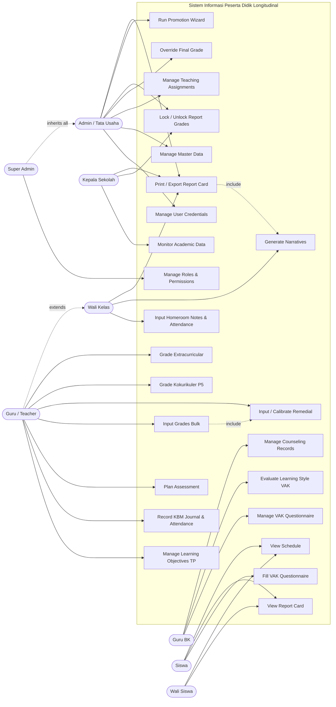

---

## 2. Database Schema Analysis (ERD & LRS)

### 2.1 Entity Relationship Diagram

```mermaid
erDiagram
    USERS ||--o| TEACHERS : "has profile"
    USERS ||--o| STUDENTS : "login account"
    USERS ||--o{ STUDENTS : "guardian_of"
    USERS ||--o{ BK_QUESTIONNAIRES : "counselor creates"
    USERS ||--o{ BK_COUNSELING_RECORDS : "counsels"

    ACADEMIC_PERIODS ||--o{ ENROLLMENTS : has
    ACADEMIC_PERIODS ||--o{ CLASS_HOMEROOMS : has
    ACADEMIC_PERIODS ||--o{ TEACHING_ASSIGNMENTS : has
    ACADEMIC_PERIODS ||--o{ LEARNING_OBJECTIVES : has

    CLASSROOMS ||--o{ ENROLLMENTS : contains
    CLASSROOMS ||--o{ CLASS_HOMEROOMS : assigned
    CLASSROOMS ||--o{ TEACHING_ASSIGNMENTS : scheduled

    STUDENTS ||--o{ ENROLLMENTS : "enrolled in"
    STUDENTS ||--o{ GRADES : scores
    STUDENTS ||--o{ FINAL_GRADES : "final score"
    STUDENTS ||--o{ STUDENT_REPORTS : "report card"
    STUDENTS ||--o{ ATTENDANCE_SUMMARIES : "attendance"
    STUDENTS ||--o{ KOKURIKULER_GRADES : "P5"
    STUDENTS ||--o{ STUDENT_SUBJECT_ENROLLMENTS : "elective/ekskul"

    TEACHERS ||--o{ TEACHING_ASSIGNMENTS : teaches
    TEACHERS ||--o{ CLASS_HOMEROOMS : "is homeroom"
    TEACHERS ||--o{ LEARNING_OBJECTIVES : authors

    SUBJECTS ||--o{ TEACHING_ASSIGNMENTS : "subject of"
    SUBJECTS ||--o{ LEARNING_OBJECTIVES : "covers"

    TEACHING_ASSIGNMENTS ||--o{ ASSESSMENTS : has
    TEACHING_ASSIGNMENTS ||--o{ SUBJECT_SCHEDULES : has
    TEACHING_ASSIGNMENTS ||--o{ ATTENDANCES : tracks
    TEACHING_ASSIGNMENTS ||--o{ LESSON_JOURNALS : logs
    TEACHING_ASSIGNMENTS ||--o{ FINAL_GRADES : produces
    TEACHING_ASSIGNMENTS ||--o{ GRADE_RANGES : "A-E rules"
    TEACHING_ASSIGNMENTS ||--o{ ATTENDANCE_SUMMARIES : aggregates
    TEACHING_ASSIGNMENTS ||--o{ STUDENT_SUBJECT_ENROLLMENTS : enrolls
    TEACHING_ASSIGNMENTS ||--o{ NARRATIVE_TEMPLATES : "custom narr"

    ASSESSMENTS ||--o{ GRADES : "graded by"
    ASSESSMENTS }o--o{ LEARNING_OBJECTIVES : "covers (pivot)"
    LESSON_JOURNALS ||--o{ ATTENDANCES : "session"

    ENROLLMENTS ||--o| ENROLLMENTS : "promoted_from"

    BK_QUESTIONNAIRES ||--o{ BK_QUESTIONS : contains
    BK_QUESTIONNAIRES ||--o{ BK_QUESTIONNAIRE_TARGETS : targets
    BK_QUESTIONNAIRES ||--o{ BK_STUDENT_RESPONSES : "answered by"
    BK_QUESTIONS ||--o{ BK_QUESTION_OPTIONS : "options"
    BK_QUESTIONS ||--o{ BK_ANSWERS : "answered"
    BK_STUDENT_RESPONSES ||--o{ BK_ANSWERS : "detail"
    BK_QUESTION_OPTIONS ||--o{ BK_ANSWERS : "selected"
    BK_COUNSELING_RECORDS ||--o{ BK_RECORD_ATTACHMENTS : "files"
    CLASSROOMS ||--o{ BK_QUESTIONNAIRE_TARGETS : targeted
```

### 2.2 Cardinality Mapping (from Eloquent relationships)

| Relationship | Type | Cardinality | Source |
|--------------|------|-------------|--------|
| User → Teacher | `hasOne` / `belongsTo` | 1:1 | User.php:98 |
| User → Student (login) | `hasOne` | 1:1 | User.php:109 |
| User → Student (guardian) | `hasMany` via `guardian_user_id` | 1:N | User.php:120 |
| Student → Enrollment | `hasMany` | 1:N | Student.php:92 |
| Student ↔ Classroom | `belongsToMany` (via enrollments) | M:N | Student.php:103 |
| Student → Classroom (current) | `hasOneThrough` (active period) | 1:1 | Student.php:117 |
| Student ↔ Extracurricular | `belongsToMany` (student_extracurriculars) | M:N | Student.php:140 |
| TeachingAssignment → Assessment | `hasMany` | 1:N | TeachingAssignment.php:88 |
| TeachingAssignment → FinalGrade | `hasMany` | 1:N | TeachingAssignment.php:108 |
| TeachingAssignment → GradeRange | `hasMany` (5 rows A–E) | 1:N | TeachingAssignment.php:243 |
| Assessment → Grade | `hasMany` | 1:N | Assessment.php:39 |
| Assessment ↔ LearningObjective | `belongsToMany` (pivot) | M:N | Assessment.php:32 |
| Enrollment → Enrollment | `belongsTo`/`hasOne` (recursive) | 1:1 | Enrollment.php:43 |
| ClassHomeroom → Classroom/Teacher/Period | `belongsTo` ×3 | N:1 | ClassHomeroom.php:86 |

### 2.3 Logical Record Structure (LRS)

Notation: **`PK`** = Primary Key (`id` bigint auto-increment), **`FK→`** = Foreign Key, `*` = unique, `?` = nullable. Cascade rules taken verbatim from migrations.

```
users
  PK  id
      name, password
      username*?, email*?, email_verified_at?
      role  ENUM(admin, headmaster, teacher, student, guardian) = student
      is_active BOOL = true
      remember_token, timestamps

teachers
  PK  id
  FK→ user_id?  -> users.id  (nullOnDelete)
      nip*?, name, gender?ENUM(L,P)
      place_of_birth?, date_of_birth?, email*?, phone?, address?
      degree?, major?, university?, graduation_year?
      employment_status?, position?, grade?, rank?, assignment_date?
      is_active BOOL = true, timestamps

students
  PK  id
  FK→ user_id?           -> users.id  (nullOnDelete)
  FK→ guardian_user_id?  -> users.id  (nullOnDelete)
      name, nipd?, nisn*?, nik?
      gender ENUM(L,P), place_of_birth?, date_of_birth?, religion?
      father_name?, mother_name?, address?
      status ENUM(active, graduated, moved, dropped_out, deceased) = active
      timestamps

academic_periods
  PK  id
      start_year, end_year, semester ENUM(odd,even)
      start_date, end_date, is_active BOOL = false, timestamps

classrooms
  PK  id
      name, grade_level INT, timestamps

subjects
  PK  id
      name, code*
      type ENUM(mandatory, kokurikuler, elective, extracurricular) = mandatory
      description?, timestamps

class_homerooms
  PK  id
  FK→ academic_period_id -> academic_periods.id (cascade)
  FK→ classroom_id       -> classrooms.id        (cascade)
  FK→ teacher_id         -> teachers.id           (cascade)
      is_current BOOL = true, timestamps

enrollments
  PK  id
  FK→ student_id                  -> students.id          (cascade)
  FK→ classroom_id                -> classrooms.id         (cascade)
  FK→ academic_period_id          -> academic_periods.id   (cascade)
  FK→ promoted_from_enrollment_id?-> enrollments.id        (nullOnDelete, recursive)
      status ENUM(active, promoted, retained, graduated, dropped) = active
      UNIQUE(student_id, academic_period_id)   -- 1 class per student per period
      timestamps

teaching_assignments  (SK Mengajar)
  PK  id
  FK→ academic_period_id -> academic_periods.id (cascade)
  FK→ teacher_id         -> teachers.id          (cascade)
  FK→ subject_id         -> subjects.id          (cascade)
  FK→ classroom_id       -> classrooms.id         (cascade)
      grading_formula = 'average'   (average | weighting | percentage)
      kktp INT? = 75
      subject_type? ENUM(mandatory, kokurikuler, elective, extracurricular)
      timestamps

subject_schedules
  PK  id
  FK→ teaching_assignment_id -> teaching_assignments.id (cascade)
      day ENUM(Senin..Minggu), start_time, end_time, room?, note?, timestamps

lesson_journals
  PK  id
  FK→ teaching_assignment_id -> teaching_assignments.id (cascade)
      date, meeting_number, topic, notes?
      status ENUM(draft, done, locked) = draft
      UNIQUE(teaching_assignment_id, date)
      timestamps

attendances
  PK  id
  FK→ teaching_assignment_id -> teaching_assignments.id (cascade)
  FK→ lesson_journal_id?     -> lesson_journals.id       (nullOnDelete)
  FK→ student_id             -> students.id              (cascade)
      date, status ENUM(present, permit, sick, alpha, holiday) = present, note?
      UNIQUE(teaching_assignment_id, student_id, date)
      INDEX(teaching_assignment_id, date, status)
      timestamps

learning_objectives  (TP)
  PK  id
  FK→ teacher_id?        -> teachers.id          (nullOnDelete)
  FK→ subject_id         -> subjects.id           (cascade)
  FK→ academic_period_id -> academic_periods.id   (cascade)
      grade_level?, phase ENUM(A..F)=D, content, code?, attribute, timestamps

assessments
  PK  id
  FK→ teaching_assignment_id -> teaching_assignments.id (cascade)
      name, category, technique, date, weight INT = 1, timestamps

assessment_learning_objective  (PIVOT M:N)
  PK  id
  FK→ assessment_id          -> assessments.id          (cascade)
  FK→ learning_objective_id  -> learning_objectives.id   (cascade)

grades
  PK  id
  FK→ assessment_id -> assessments.id (cascade)
  FK→ student_id    -> students.id     (cascade)
      score?, original_score?, remedial_attempts UINT = 0, feedback?
      UNIQUE(assessment_id, student_id)
      timestamps

kokurikuler_grades  (P5)
  PK  id
  FK→ student_id         -> students.id         (cascade)
  FK→ academic_period_id -> academic_periods.id  (cascade)
      project_title, narrative_description, timestamps
      (NO unique -> a student may join many P5 projects)

attendance_summaries  (snapshot, maintained by AttendanceObserver)
  PK  id
  FK→ student_id             -> students.id              (cascade)
  FK→ teaching_assignment_id -> teaching_assignments.id  (cascade)
      semester ENUM(odd,even), present, permit, sick, alpha (USMALLINT=0)
      attendance_percentage DECIMAL(5,2)=0
      UNIQUE(student_id, teaching_assignment_id, semester)
      timestamps

final_grades  (snapshot of calculateFinalGrade(), maintained by GradeObserver)
  PK  id
  FK→ student_id             -> students.id              (cascade)
  FK→ teaching_assignment_id -> teaching_assignments.id  (cascade)
      semester ENUM(odd,even)
      final_score DECIMAL(5,2)?
      grade_label ENUM(A,B,C,D,E)?
      narrative_description?
      is_locked BOOL = false           <-- Wali Kelas lock gate
      is_manual_override BOOL = false  <-- Admin override gate
      locked_at?
      UNIQUE(student_id, teaching_assignment_id, semester)
      timestamps

grade_ranges  (internal A-E rule engine; never shown to student)
  PK  id
  FK→ teaching_assignment_id -> teaching_assignments.id (cascade)
      letter ENUM(A,B,C,D,E), min_score DECIMAL(5,2), max_score DECIMAL(5,2)
      UNIQUE(teaching_assignment_id, letter)
      timestamps

student_subject_enrollments  (elective / extracurricular pivot)
  PK  id
  FK→ student_id             -> students.id              (cascade)
  FK→ teaching_assignment_id -> teaching_assignments.id  (cascade)
      note?, predicate?, description?
      UNIQUE(student_id, teaching_assignment_id)
      timestamps

student_reports  (Wali Kelas input layer)
  PK  id
  FK→ student_id         -> students.id          (cascade)
  FK→ academic_period_id -> academic_periods.id   (cascade)
  FK→ classroom_id       -> classrooms.id          (cascade)
      homeroom_notes?
      sick_days INT=0, excused_days INT=0, unexcused_days INT=0
      is_locked BOOL=false, locked_at?
      UNIQUE(student_id, academic_period_id)   -- 1 report per student per period
      timestamps

-- BK (Guidance & Counseling) module --
bk_questionnaires        PK id; FK counselor_id?->users, academic_period_id->academic_periods; status ENUM(draft,published,closed)
bk_questionnaire_targets PK id; FK questionnaire_id->bk_questionnaires, classroom_id->classrooms; UNIQUE(questionnaire_id, classroom_id)
bk_questions             PK id; FK questionnaire_id->bk_questionnaires; question_type ENUM(single_choice,multiple_choice,text,scale); INDEX(questionnaire_id,order)
bk_question_options      PK id; FK question_id->bk_questions; option_code?, score_weight DECIMAL(5,2)
bk_student_responses     PK id; FK questionnaire_id, student_id, academic_period_id; status ENUM(pending,completed,revoked); dominant_style?, score?, score_distribution(json), ai_* placeholders; UNIQUE(questionnaire_id, student_id)
bk_answers               PK id; FK response_id->bk_student_responses, question_id->bk_questions, selected_option_id?->bk_question_options; text_answer?; INDEX(response_id, question_id)
bk_counseling_records    PK id; FK student_id->students, counselor_id->users; session_type ENUM(...); category ENUM(pribadi,sosial,belajar,karir,lainnya); visibility flags x4; INDEX(student_id, session_date)
bk_record_attachments    PK id; FK record_id->bk_counseling_records; file_path, file_type?
```

> Note: `students.classrooms()` (M:N) and `students.extracurriculars()` reference pivot tables `enrollments` and `student_extracurriculars`. The `projects` / `project_grades` tables exist in the `academic_structure` migration as a richer P5 model, but the active runtime path for P5 reporting uses the simpler `kokurikuler_grades` table.

---

## 3. Core Workflow Analysis

### 3.1 Workflow A — Grading & Remedial (Activity Diagram)

This traces the path through `app/Filament/Resources/TeachingAssignmentResource/RelationManagers/AssessmentsRelationManager.php`, the `app/Observers/GradeObserver.php`, and `TeachingAssignment::calculateFinalGrade()`.

**Key architectural nuance:** The bulk-input action **deliberately disables** the `GradeObserver` via `Grade::withoutEvents()` to avoid N+1 recalculation (30 students = 60+ queries), then recalculates once per student manually. The Observer remains the *fallback* path for any single `Grade` save that occurs **outside** the bulk action.

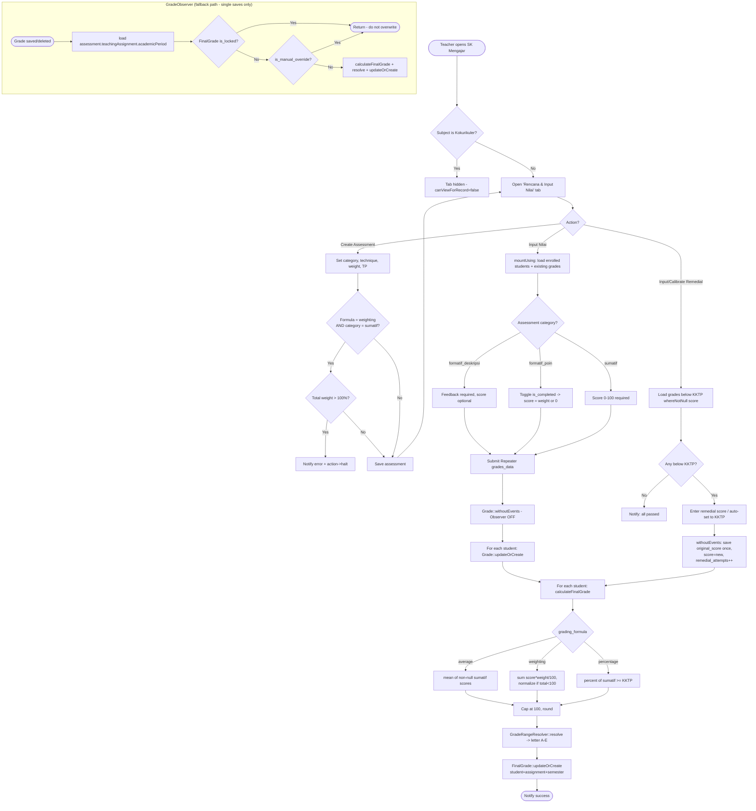

**Decision-node summary (the two protective gates in `GradeObserver::recalculate`):**

1. **`is_locked`** — set by Wali Kelas/Admin "Kunci Semua Nilai". Once locked, printed report grades are frozen; the observer returns early.
2. **`is_manual_override`** — set by Admin in `FinalGradesRelationManager` (Hidden field defaulting `true`). Auto-calculation will never overwrite a manually entered grade.

### 3.2 Workflow B — Report Generation / Native HTML Print (Sequence Diagram)

This traces the **"Cetak Rapor"** action in `app/Filament/Resources/RaporResource/Pages/ViewRapor.php:238` → `route('rapor.print')` → `app/Http/Controllers/RaporPrintController.php` → `app/Services/RaporExportService.php` → `resources/views/rapor/print.blade.php`.

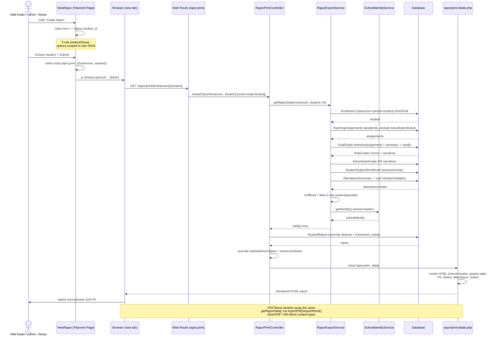

**Sequence notes:**

- **Layered reuse:** `RaporPrintController`, `exportPdf()`, and `exportWord()` all funnel through the single `getRaporData()` method — one data-assembly source of truth, three render targets (HTML / DomPDF / Word).
- **Official vs. Shadow report:** `isOfficial` flips to `false` when the viewer is a student/guardian, allowing the Blade to render a watermark/"bayangan" (unofficial) version.
- **StudentReport override:** The controller layer overrides the auto-aggregated attendance with the Wali-Kelas-entered values from `student_reports` (the human-in-the-loop final say), and injects `homeroom_notes`.

### 3.3 Workflow C — Final Grade Intervention (Activity Diagram with Swimlanes)

**Alur Intervensi Nilai Akhir** — this diagram models the two competing write paths to the `final_grades` table and the guard logic that arbitrates between them:

- The **automated path** (Teacher inputs daily grades → `GradeObserver` recalculates), and
- The **manual path** (Admin enters a legacy/transfer grade directly via `FinalGradesRelationManager`, which sets `is_manual_override = true`).

The System lane is the arbiter: it *intercepts* the Teacher's `Grade saved` event and consults two protective flags (`is_locked`, `is_manual_override`) before deciding whether to overwrite. The Admin's manual write deliberately **bypasses** the calculation engine, and its `is_manual_override` flag makes all subsequent automated recalculations back off — guaranteeing the manual value survives later teacher edits.

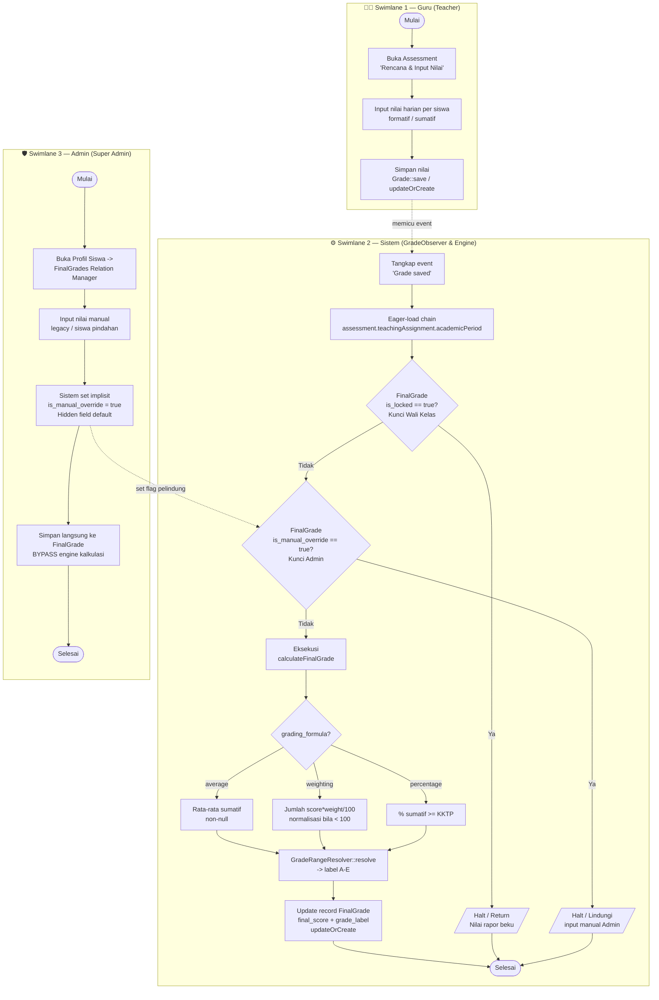

**Diagram reading guide:**

| Path | Trigger | Engine involvement | Outcome |
|------|---------|--------------------|---------|
| **Automated (Teacher)** | `Grade saved` event | `GradeObserver` → `calculateFinalGrade()` | Overwrites `final_grades` **only if** neither flag is set |
| **Manual (Admin)** | Direct write in `FinalGradesRelationManager` | None — engine bypassed | Writes `final_score` + sets `is_manual_override = true` |
| **Interception** | Any teacher edit *after* an Admin override | Observer fires, hits `is_manual_override == true` | Halts → Admin's value is protected and preserved |

> The dotted cross-lane arrows show the System lane's role as arbiter: `G_Save` *triggers* the observer event, while the Admin's `A_Flag` step *plants the protective flag* that the System later honors at Decision Node 2. This is the mechanism that lets a manual legacy/transfer grade coexist with — and take precedence over — the automated calculation engine.

---

## Appendix — Key Architectural Observations

1. **Snapshot pattern:** `final_grades` and `attendance_summaries` are observer-maintained denormalized snapshots, decoupling expensive per-grade recalculation from report rendering.
2. **Three-tier grade protection:** raw `grades` → calculated `final_grades` (auto) → `is_manual_override` (admin) → `is_locked` (finalization). Each tier guards the next from being overwritten.
3. **Configurable grading engine:** `grading_formula` (average / weighting / percentage) + `kktp` (with `SchoolSetting` fallback chain → 75) + `grade_ranges` rule engine drive a fully data-driven assessment model aligned to Kurikulum Merdeka.
4. **Performance-conscious:** explicit `withoutEvents()` + eager-load chains (`assessment.teachingAssignment.academicPeriod`) show deliberate N+1 mitigation throughout the grading path.
5. **Longitudinal design:** the recursive `enrollments.promoted_from_enrollment_id` self-reference is the backbone of the "Longitudinal" (multi-year tracking) nature of the system.

---

# Appendix B — Dual-Format Diagrams (Mermaid + PlantUML)

> This appendix mirrors the report's core blueprints in **both Mermaid.js and PlantUML** so either renderer can be used for the formal documentation (Bab 3 / Bab 4). All findings are traced to source files cited inline. No application code was modified.

## B.1 Use Case Analysis

### B.1.1 Use Case Table

| Actor | Use Case | Description | Pre-condition |
|-------|----------|-------------|---------------|
| **Super Admin** | Manage Roles & Permissions | Configure Spatie roles; all gates auto-granted | `super_admin`, active |
| **Admin** | Manage Users / Master Data | CRUD users, students, teachers, classrooms, subjects | `*_user`, `*_student`… |
| **Admin** | Manage Teaching Assignments | CRUD SK Mengajar | `*_teaching::assignment` |
| **Admin** | Override Final Grade | Manual grade, sets `is_manual_override=true` | `admin`/`super_admin` |
| **Admin** | Lock / Unlock Grades · Promotion | Finalize `final_grades`; run promotion wizard | `admin`, `page_StudentPromotionWizard` |
| **Headmaster** | Monitor Academic Data | Read-only over all entities & reports | `view_*` only |
| **Teacher** | Manage TP / KBM Journal | CRUD learning objectives, lesson journals, attendance | `*_learning::objective`, `*_lesson::journal` |
| **Teacher** | Plan Assessment & Input Grades | Create assessments + weights, bulk-input scores | owns TeachingAssignment |
| **Teacher** | Input / Calibrate Remedial | Re-score below-KKTP, preserve `original_score` | grade < KKTP |
| **Wali Kelas** | Homeroom Notes & Print Report | Fill `student_reports`, generate narratives, print | `is_current` homeroom |
| **Guru BK** | Manage VAK Questionnaire | CRUD questionnaire, publish, open access (tickets) | `*_bk::questionnaire` |
| **Guru BK** | Evaluate / Recalculate Response | Score V/A/K, set feedback & recommendation | response `completed` |
| **Guru BK** | Manage Counseling Records | CRUD `bk_counseling_records` + visibility flags | `*_bk::counseling::record` |
| **Student** | Fill VAK Questionnaire · View Report | Submit answers (ticket open); view shadow report | `page_MyQuestionnaires`, `view_rapor` |
| **Guardian** | View Child Report & Learning Style | Monitor linked children | `guardian_user_id` link |

### B.1.2 Use Case Diagram — Mermaid

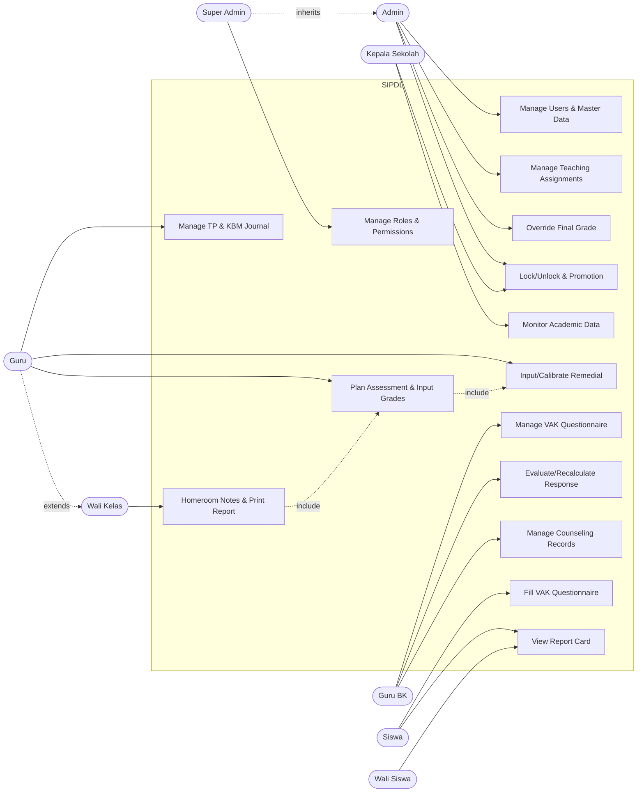

### B.1.3 Use Case Diagram — PlantUML

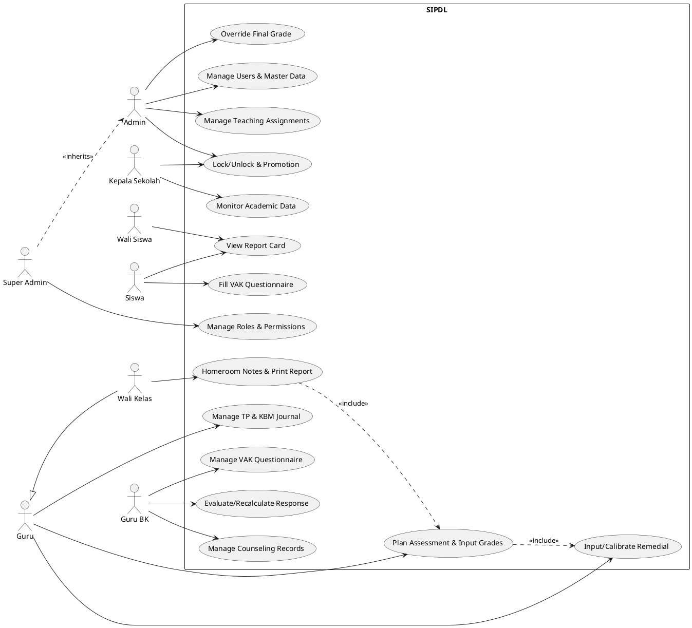

## B.2 Database Schema (ERD & LRS)

### B.2.1 ERD — Mermaid (core entities)

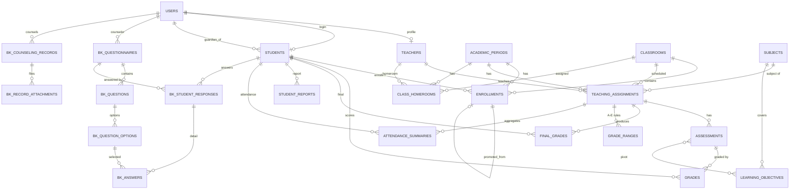

### B.2.2 ERD — PlantUML

```plantuml
@startuml
hide circle
skinparam linetype ortho

entity users { *id : PK }
entity teachers { *id : PK
  --
  user_id : FK }
entity students { *id : PK
  --
  user_id : FK
  guardian_user_id : FK }
entity academic_periods { *id : PK }
entity classrooms { *id : PK }
entity subjects { *id : PK }
entity enrollments { *id : PK
  --
  student_id : FK
  classroom_id : FK
  academic_period_id : FK
  promoted_from_enrollment_id : FK }
entity class_homerooms { *id : PK
  --
  classroom_id : FK
  teacher_id : FK
  academic_period_id : FK }
entity teaching_assignments { *id : PK
  --
  academic_period_id : FK
  teacher_id : FK
  subject_id : FK
  classroom_id : FK }
entity assessments { *id : PK
  --
  teaching_assignment_id : FK }
entity learning_objectives { *id : PK
  --
  subject_id : FK
  academic_period_id : FK }
entity assessment_learning_objective { *id : PK
  --
  assessment_id : FK
  learning_objective_id : FK }
entity grades { *id : PK
  --
  assessment_id : FK
  student_id : FK }
entity final_grades { *id : PK
  --
  student_id : FK
  teaching_assignment_id : FK }
entity grade_ranges { *id : PK
  --
  teaching_assignment_id : FK }
entity attendance_summaries { *id : PK
  --
  student_id : FK
  teaching_assignment_id : FK }
entity student_reports { *id : PK
  --
  student_id : FK
  academic_period_id : FK
  classroom_id : FK }
entity bk_questionnaires { *id : PK
  --
  counselor_id : FK
  academic_period_id : FK }
entity bk_questions { *id : PK
  --
  questionnaire_id : FK }
entity bk_question_options { *id : PK
  --
  question_id : FK }
entity bk_student_responses { *id : PK
  --
  questionnaire_id : FK
  student_id : FK }
entity bk_answers { *id : PK
  --
  response_id : FK
  question_id : FK
  selected_option_id : FK }

users ||--o| teachers
users ||--o| students
users ||--o{ students
users ||--o{ bk_questionnaires
academic_periods ||--o{ enrollments
academic_periods ||--o{ teaching_assignments
academic_periods ||--o{ class_homerooms
classrooms ||--o{ enrollments
classrooms ||--o{ teaching_assignments
classrooms ||--o{ class_homerooms
students ||--o{ enrollments
students ||--o{ grades
students ||--o{ final_grades
students ||--o{ student_reports
students ||--o{ attendance_summaries
students ||--o{ bk_student_responses
teachers ||--o{ teaching_assignments
teachers ||--o{ class_homerooms
subjects ||--o{ teaching_assignments
subjects ||--o{ learning_objectives
teaching_assignments ||--o{ assessments
teaching_assignments ||--o{ final_grades
teaching_assignments ||--o{ grade_ranges
teaching_assignments ||--o{ attendance_summaries
assessments ||--o{ grades
assessments ||--o{ assessment_learning_objective
learning_objectives ||--o{ assessment_learning_objective
enrollments ||--o| enrollments
bk_questionnaires ||--o{ bk_questions
bk_questionnaires ||--o{ bk_student_responses
bk_questions ||--o{ bk_question_options
bk_student_responses ||--o{ bk_answers
bk_question_options ||--o{ bk_answers
@enduml
```

### B.2.3 Logical Record Structure (LRS)

`PK`=primary key (`id` bigint auto-inc) · `FK→`=foreign key · `*`=unique · `?`=nullable. Cardinality from Eloquent.

```
users            PK id | username*?, email*?, role ENUM(admin,headmaster,teacher,student,guardian), is_active
teachers         PK id | FK→users.id(user_id?,nullOnDel) | nip*?, name, is_active                         [User 1:1 Teacher]
students         PK id | FK→users.id(user_id?), FK→users.id(guardian_user_id?) | nisn*?, status ENUM(...)  [User 1:N guardian]
academic_periods PK id | start_year,end_year, semester ENUM(odd,even), is_active
classrooms       PK id | name, grade_level
subjects         PK id | code*, type ENUM(mandatory,kokurikuler,elective,extracurricular)
class_homerooms  PK id | FK→academic_periods, FK→classrooms, FK→teachers | is_current
enrollments      PK id | FK→students, FK→classrooms, FK→academic_periods, FK→enrollments(promoted_from?)
                 | status ENUM(active,promoted,retained,graduated,dropped) | UNIQUE(student_id,academic_period_id)
teaching_assignments PK id | FK→academic_periods, FK→teachers, FK→subjects, FK→classrooms
                 | grading_formula(average|weighting|percentage), kktp?=75, subject_type?ENUM(...)
subject_schedules PK id | FK→teaching_assignments | day ENUM(Senin..Minggu), start_time, end_time
lesson_journals  PK id | FK→teaching_assignments | date, meeting_number, status ENUM(draft,done,locked)
                 | UNIQUE(teaching_assignment_id,date)
attendances      PK id | FK→teaching_assignments, FK→lesson_journals(?), FK→students
                 | status ENUM(present,permit,sick,alpha,holiday) | UNIQUE(teaching_assignment_id,student_id,date)
learning_objectives PK id | FK→teachers(?), FK→subjects, FK→academic_periods | phase ENUM(A..F), code?, attribute
assessments      PK id | FK→teaching_assignments | name, category, technique, date, weight=1
assessment_learning_objective PK id | FK→assessments, FK→learning_objectives                    [M:N pivot]
grades           PK id | FK→assessments, FK→students | score?, original_score?, remedial_attempts
                 | UNIQUE(assessment_id,student_id)
kokurikuler_grades PK id | FK→students, FK→academic_periods | project_title, narrative_description (no unique)
attendance_summaries PK id | FK→students, FK→teaching_assignments | semester ENUM(odd,even), present/permit/sick/alpha
                 | attendance_percentage DEC(5,2) | UNIQUE(student_id,teaching_assignment_id,semester)
final_grades     PK id | FK→students, FK→teaching_assignments | semester, final_score DEC(5,2)?
                 | grade_label ENUM(A..E)?, narrative_description?, is_locked, is_manual_override, locked_at?
                 | UNIQUE(student_id,teaching_assignment_id,semester)
grade_ranges     PK id | FK→teaching_assignments | letter ENUM(A..E), min_score, max_score
                 | UNIQUE(teaching_assignment_id,letter)
student_subject_enrollments PK id | FK→students, FK→teaching_assignments | predicate?, description?
                 | UNIQUE(student_id,teaching_assignment_id)
student_reports  PK id | FK→students, FK→academic_periods, FK→classrooms | homeroom_notes?, sick/excused/unexcused_days
                 | is_locked | UNIQUE(student_id,academic_period_id)
-- BK module --
bk_questionnaires        PK id | FK→users(counselor_id?), FK→academic_periods | status ENUM(draft,published,closed), starts_at?, ends_at?
bk_questionnaire_targets PK id | FK→bk_questionnaires, FK→classrooms | UNIQUE(questionnaire_id,classroom_id)
bk_questions             PK id | FK→bk_questionnaires | question_type ENUM(single_choice,multiple_choice,text,scale), order
bk_question_options      PK id | FK→bk_questions | option_text, option_code? (V/A/K), score_weight DEC(5,2)
bk_student_responses     PK id | FK→bk_questionnaires, FK→students, FK→academic_periods
                 | status ENUM(pending,completed,revoked), submitted_at?, dominant_style?, score?,
                 | score_distribution(json), evaluated_at?, ai_* placeholders | UNIQUE(questionnaire_id,student_id)
bk_answers               PK id | FK→bk_student_responses, FK→bk_questions, FK→bk_question_options(?)
bk_counseling_records    PK id | FK→students, FK→users(counselor_id) | session_type, category ENUM(...), visibility flags x4
bk_record_attachments    PK id | FK→bk_counseling_records | file_path, file_type?
```

## B.3 Workflow 1 — Asesmen Kognitif (VAK Learning Style)

**Traced files:** `BkQuestionnaireResource.php` (publish + "Buka Akses Asesmen" ticketing, line 200), `MyQuestionnaires.php` (`submitQuestionnaire`, line 181), `VakScoringService.php` (`score()`). Scoring counts answer `option_code` ∈ {VISUAL, AUDITORI, KINESTETIK}, takes the max (ties → "Campuran"), computes percentage, generates a recommendation, and stamps `evaluated_at`.

### B.3.1 Activity Diagram — Mermaid

```mermaid
flowchart TD
    Start([Mulai]) --> BK1

    subgraph LANE_BK["🧑‍🏫 Guru BK"]
        BK1[Buat kuesioner VAK<br/>+ pertanyaan & opsi<br/>option_code = V/A/K]
        BK2[Publish kuesioner<br/>status = published]
        BK3[Buka Akses Asesmen<br/>pilih kelas target]
        BK1 --> BK2 --> BK3
    end

    subgraph LANE_SYS["⚙️ Sistem"]
        SY1[Buat tiket 'pending'<br/>BkStudentResponse per siswa aktif]
        SY2[Tampilkan tiket pending<br/>di halaman siswa]
        SY3[Simpan jawaban + status='completed'<br/>+ submitted_at]
        SY4{Judul mengandung 'vak'?}
        SY5[VakScoringService.score:<br/>hitung V, A, K dari option_code]
        SY6{Total jawaban valid > 0?}
        SY7[dominant = 'Tidak Diketahui']
        SY8{Skor seri / tie?}
        SY9[dominant = 'Campuran (X-Y)']
        SY10[dominant = gaya tunggal]
        SY11[Hitung persentase + rekomendasi<br/>update score_distribution, feedback,<br/>recommendation, evaluated_at]
        SY12[Simpan respons saja<br/>tanpa skoring VAK]
    end

    subgraph LANE_ST["🧑‍🎓 Siswa"]
        ST1[Lihat kuesioner tersedia]
        ST2[Isi & kirim jawaban]
        ST1 --> ST2
    end

    BK3 --> SY1 --> SY2 --> ST1
    ST2 --> SY3 --> SY4
    SY4 -->|Tidak| SY12 --> End
    SY4 -->|Ya| SY5 --> SY6
    SY6 -->|Tidak| SY7 --> End
    SY6 -->|Ya| SY8
    SY8 -->|Ya| SY9 --> SY11
    SY8 -->|Tidak| SY10 --> SY11
    SY11 --> End([Selesai])
```

### B.3.2 Activity Diagram — PlantUML

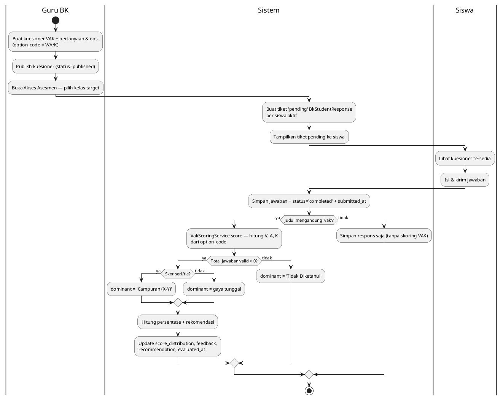

## B.4 Workflow 2 — Penilaian Sumatif (Summative Assessment)

**Traced files:** `AssessmentsRelationManager.php` (create plan + weight validation, bulk `input_grades`), `TeachingAssignment::calculateFinalGrade()`, `GradeRangeResolver::resolve()`. Bulk input uses `Grade::withoutEvents()` then recalculates once per student.

### B.4.1 Activity Diagram — Mermaid

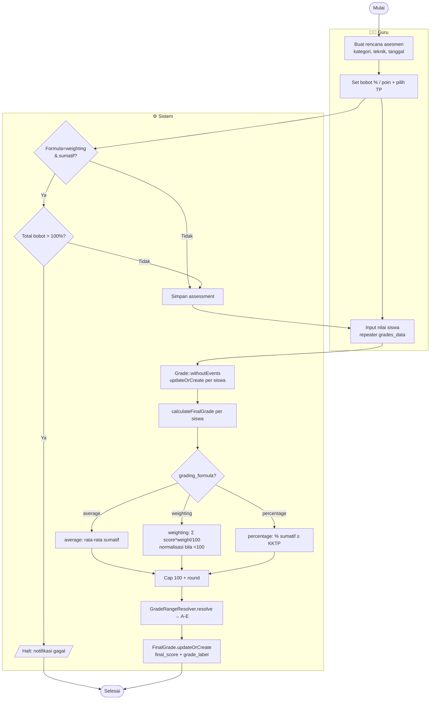

### B.4.2 Activity Diagram — PlantUML

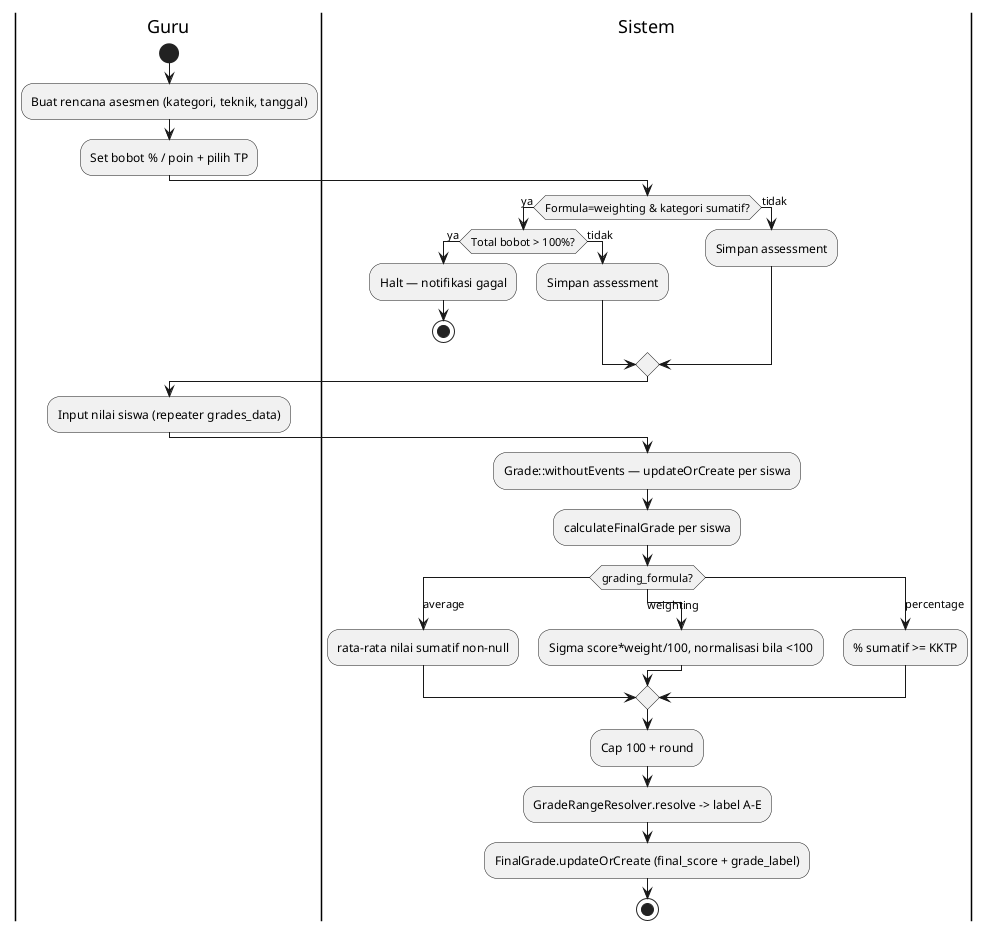

## B.5 Workflow 3 — Rapor Generation (Sequence Diagram)

**Traced path:** `ViewRapor.php` (`cetak_rapor` action, line 238) → `route('rapor.print')` → `RaporPrintController::show` → `RaporExportService::getRaporData` → `rapor/print.blade.php`.

### B.5.1 Sequence Diagram — Mermaid

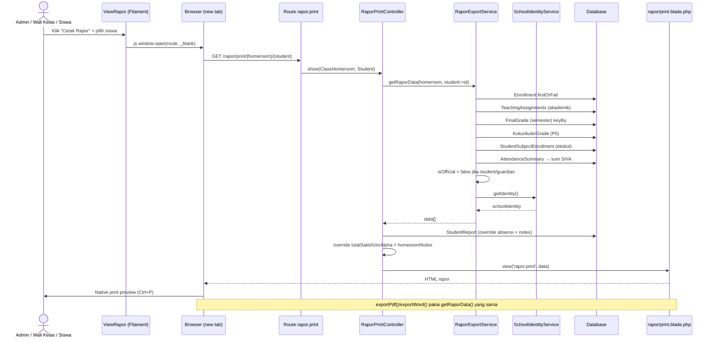

### B.5.2 Sequence Diagram — PlantUML

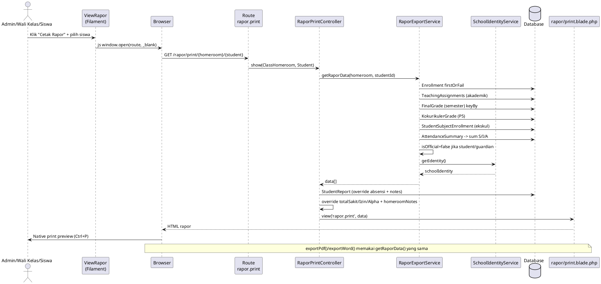
