# Dokumentasi UML — SIPDL (Sistem Informasi Peserta Didik Longitudinal)

Aplikasi berbasis **Laravel TALL Stack + Filament v3**. Dokumen ini merangkum **9 Use Case** inti, masing-masing dengan **Deskripsi Use Case**, **Activity Diagram (PlantUML)**, dan **Sequence Diagram berbasis MVC (PlantUML)**.

> Konvensi MVC pada Sequence Diagram:
> **Boundary/View** = Halaman Filament / Blade UI · **Control/Controller** = Filament Resource / RelationManager / Controller / Service · **Entity/Model** = Eloquent Model · **Database** = MySQL.
>
> Seluruh kode PlantUML memakai sintaks valid (`@startuml … @enduml`). Setiap Activity Diagram memiliki **satu Start dan satu End**; jalur validasi/alternatif memakai **`repeat` (loop)** atau **penggabungan cabang (merge)** sehingga tidak ada cabang menggantung (`detach`).

## Daftar Use Case

| No | Use Case | Aktor |
|----|----------|-------|
| 1 | Mengelola Data Master | Admin |
| 2 | Mengelola Penugasan Pembelajaran (SK Mengajar) | Admin |
| 3 | Kelola Tujuan Pembelajaran (TP) | Guru |
| 4 | Mengelola Jurnal KBM dan Absensi | Guru |
| 5 | Input Nilai Sumatif/Formatif & Hitung Nilai Akhir | Guru |
| 6 | Kunci dan Cetak Rapor | Guru (Wali Kelas) / Admin |
| 7 | Memantau Kinerja Penilaian Guru | Kepala Sekolah |
| 8 | Memantau Perkembangan Akademik | Siswa & Orang Tua |
| 9 | Login | Semua Aktor |

---

# USE CASE 1 — Mengelola Data Master (Admin)

## 1. Deskripsi Use Case

| Komponen | Keterangan |
|----------|------------|
| **Nama Use Case** | Mengelola Data Master |
| **Aktor** | Admin / Operator |
| **Deskripsi Singkat** | Admin mengelola (CRUD) entitas master inti: Siswa, Guru, Kelas, Mata Pelajaran, dan Tahun Ajaran/Periode Akademik melalui panel Filament. |
| **Pre-condition** | Admin sudah login (`is_active = true`) dan memiliki hak akses ke resource master data. |
| **Post-condition** | Data master tersimpan/diperbarui/terhapus di database; tersedia sebagai referensi untuk modul akademik (penugasan, nilai, rapor). |
| **Skenario Utama (Main Success Scenario)** | 1. Admin memilih menu master data (mis. Data Siswa). 2. Sistem menampilkan tabel daftar data. 3. Admin menekan "New / Create". 4. Sistem menampilkan form input. 5. Admin mengisi data lalu menekan "Simpan". 6. Sistem memvalidasi input (mis. NISN unik, kolom wajib). 7. Sistem menyimpan data ke database. 8. Sistem menampilkan notifikasi sukses dan memperbarui tabel. |
| **Skenario Alternatif** | 6a. Validasi gagal → sistem menampilkan pesan error, kembali ke form. 3a. Admin memilih Edit/Delete pada baris tertentu → alur serupa untuk update/hapus. |

> Catatan kode: aktor & entitas merujuk pada `StudentResource`, `TeacherResource`, `ClassroomResource`, `SubjectResource`, `AcademicPeriodResource` (`app/Filament/Resources/`). Validasi unik mengikuti skema migrasi (mis. `students.nisn` unik, `subjects.code` unik).

## 2. Activity Diagram (PlantUML)

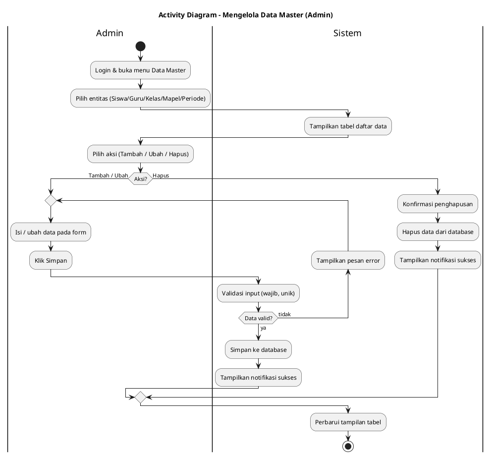
```plantuml
@startuml
title Activity Diagram - Mengelola Data Master (Admin)
|Admin|
start
:Login & buka menu Data Master;
:Pilih entitas (Siswa/Guru/Kelas/Mapel/Periode);
|Sistem|
:Tampilkan tabel daftar data;
|Admin|
:Pilih aksi (Tambah / Ubah / Hapus);
if (Aksi?) then (Tambah / Ubah)
  repeat
    :Isi / ubah data pada form;
    :Klik Simpan;
    |Sistem|
    :Validasi input (wajib, unik);
  backward:Tampilkan pesan error;
  repeat while (Data valid?) is (tidak) not (ya)
  :Simpan ke database;
  :Tampilkan notifikasi sukses;
else (Hapus)
  |Sistem|
  :Konfirmasi penghapusan;
  :Hapus data dari database;
  :Tampilkan notifikasi sukses;
endif
|Sistem|
:Perbarui tampilan tabel;
stop
@enduml
```

## 3. Sequence Diagram berbasis MVC (PlantUML)

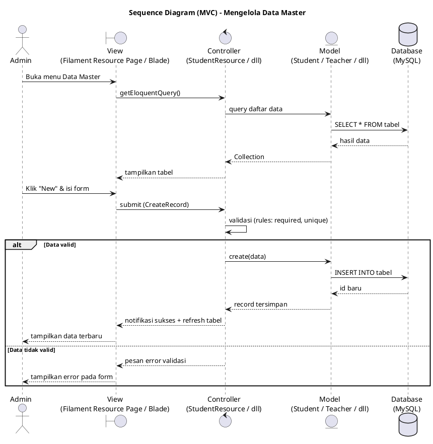
```plantuml
@startuml
title Sequence Diagram (MVC) - Mengelola Data Master
actor "Admin" as Admin
boundary "View\n(Filament Resource Page / Blade)" as View
control "Controller\n(StudentResource / dll)" as Ctrl
entity "Model\n(Student / Teacher / dll)" as Model
database "Database\n(MySQL)" as DB

Admin -> View : Buka menu Data Master
View -> Ctrl : getEloquentQuery()
Ctrl -> Model : query daftar data
Model -> DB : SELECT * FROM tabel
DB --> Model : hasil data
Model --> Ctrl : Collection
Ctrl --> View : tampilkan tabel

Admin -> View : Klik "New" & isi form
View -> Ctrl : submit (CreateRecord)
Ctrl -> Ctrl : validasi (rules: required, unique)
alt Data valid
  Ctrl -> Model : create(data)
  Model -> DB : INSERT INTO tabel
  DB --> Model : id baru
  Model --> Ctrl : record tersimpan
  Ctrl --> View : notifikasi sukses + refresh tabel
  View --> Admin : tampilkan data terbaru
else Data tidak valid
  Ctrl --> View : pesan error validasi
  View --> Admin : tampilkan error pada form
end
@enduml
```

---

# USE CASE 2 — Mengelola Penugasan Pembelajaran (SK Mengajar)

## 1. Deskripsi Use Case

| Komponen | Keterangan |
|----------|------------|
| **Nama Use Case** | Mengelola Penugasan Pembelajaran (SK Mengajar) |
| **Aktor** | Admin / Operator |
| **Deskripsi Singkat** | Admin menetapkan penugasan: menautkan Guru ke Mata Pelajaran dan Kelas pada Tahun Ajaran aktif, beserta konfigurasi penilaian (formula nilai & KKTP). |
| **Pre-condition** | Admin login; data master (Guru, Mapel, Kelas, Periode Akademik) sudah tersedia; minimal ada satu `AcademicPeriod` aktif. |
| **Post-condition** | Record `TeachingAssignment` tersimpan; sistem otomatis menetapkan KKTP default dan men-*seed* 5 baris `grade_ranges` (A–E) untuk SK Mengajar tersebut. |
| **Skenario Utama (Main Success Scenario)** | 1. Admin membuka menu SK Mengajar. 2. Sistem menampilkan tabel penugasan. 3. Admin menekan "New". 4. Admin memilih Guru, Mata Pelajaran, Kelas, Periode Akademik, dan formula penilaian. 5. Admin menekan "Simpan". 6. Sistem memvalidasi input. 7. Sistem menyimpan penugasan ke database. 8. Sistem (model event) mengisi KKTP default & men-*generate* `grade_ranges`. 9. Sistem menampilkan notifikasi sukses dan memperbarui tabel. |
| **Skenario Alternatif** | 6a. Input tidak lengkap → sistem menampilkan error validasi. 4a. Admin memilih Edit; bila KKTP diubah, sistem menghitung ulang `grade_ranges`. |

> Catatan kode: penetapan KKTP default & `seedDefaults()` terjadi pada `TeachingAssignment::booted()` (event `creating`/`created`/`updated`) memanggil `GradeRangeResolver::seedDefaults()`.

## 2. Activity Diagram (PlantUML)

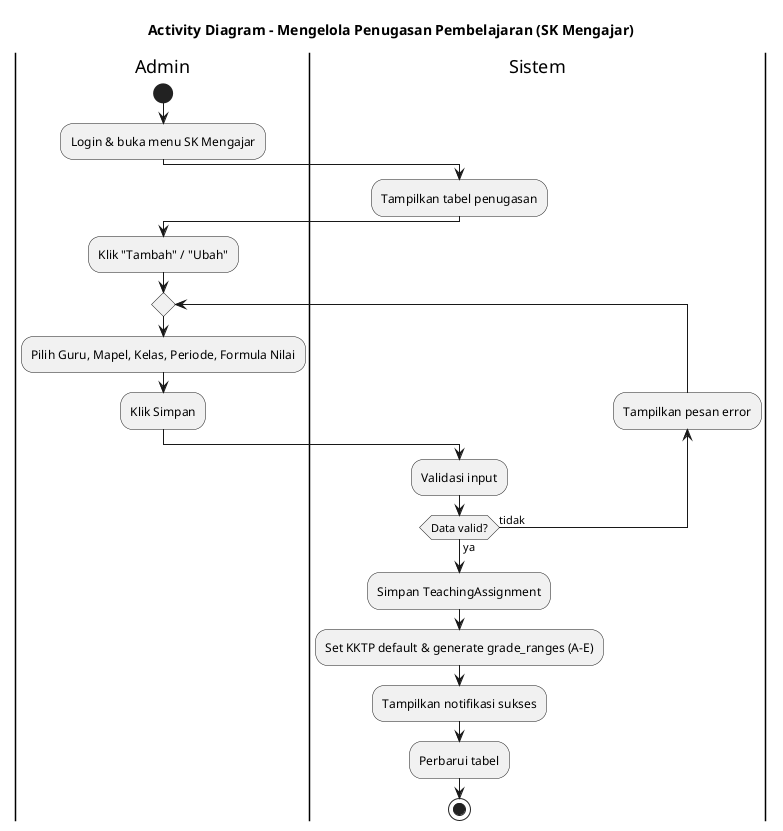
```plantuml
@startuml
title Activity Diagram - Mengelola Penugasan Pembelajaran (SK Mengajar)
|Admin|
start
:Login & buka menu SK Mengajar;
|Sistem|
:Tampilkan tabel penugasan;
|Admin|
:Klik "Tambah" / "Ubah";
repeat
  :Pilih Guru, Mapel, Kelas, Periode, Formula Nilai;
  :Klik Simpan;
  |Sistem|
  :Validasi input;
backward:Tampilkan pesan error;
repeat while (Data valid?) is (tidak) not (ya)
:Simpan TeachingAssignment;
:Set KKTP default & generate grade_ranges (A-E);
:Tampilkan notifikasi sukses;
:Perbarui tabel;
stop
@enduml
```

## 3. Sequence Diagram berbasis MVC (PlantUML)

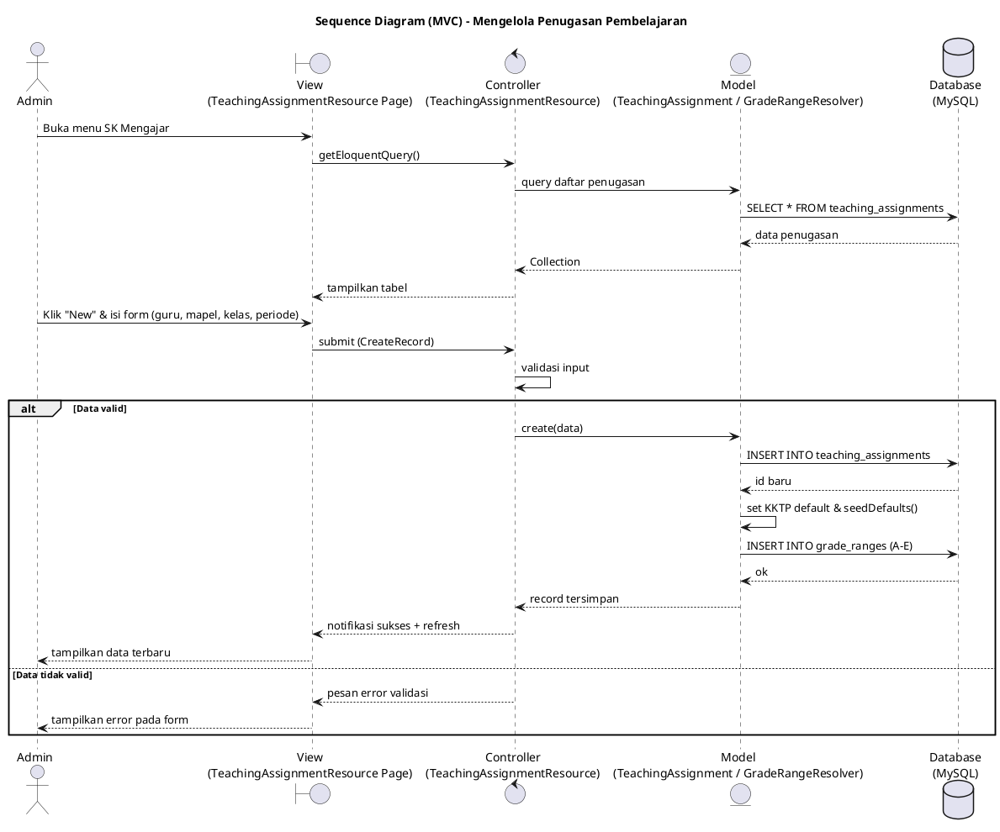
```plantuml
@startuml
title Sequence Diagram (MVC) - Mengelola Penugasan Pembelajaran
actor "Admin" as Admin
boundary "View\n(TeachingAssignmentResource Page)" as View
control "Controller\n(TeachingAssignmentResource)" as Ctrl
entity "Model\n(TeachingAssignment / GradeRangeResolver)" as Model
database "Database\n(MySQL)" as DB

Admin -> View : Buka menu SK Mengajar
View -> Ctrl : getEloquentQuery()
Ctrl -> Model : query daftar penugasan
Model -> DB : SELECT * FROM teaching_assignments
DB --> Model : data penugasan
Model --> Ctrl : Collection
Ctrl --> View : tampilkan tabel

Admin -> View : Klik "New" & isi form (guru, mapel, kelas, periode)
View -> Ctrl : submit (CreateRecord)
Ctrl -> Ctrl : validasi input
alt Data valid
  Ctrl -> Model : create(data)
  Model -> DB : INSERT INTO teaching_assignments
  DB --> Model : id baru
  Model -> Model : set KKTP default & seedDefaults()
  Model -> DB : INSERT INTO grade_ranges (A-E)
  DB --> Model : ok
  Model --> Ctrl : record tersimpan
  Ctrl --> View : notifikasi sukses + refresh
  View --> Admin : tampilkan data terbaru
else Data tidak valid
  Ctrl --> View : pesan error validasi
  View --> Admin : tampilkan error pada form
end
@enduml
```

---

# USE CASE 3 — Kelola Tujuan Pembelajaran (TP)

## 1. Deskripsi Use Case

| Komponen | Keterangan |
|----------|------------|
| **Nama Use Case** | Kelola Tujuan Pembelajaran (TP) |
| **Aktor** | Guru |
| **Deskripsi Singkat** | Guru menyusun daftar Tujuan Pembelajaran per mata pelajaran, fase, dan tingkat kelas. Penamaan kode TP mengikuti **panduan format (konvensi)** yang dipandu `helperText`, sebagai acuan asesmen & deskripsi rapor. |
| **Pre-condition** | Guru login; mata pelajaran dan periode akademik tersedia. |
| **Post-condition** | Record `LearningObjective` tersimpan (kode TP, fase, konten, atribut) dan siap ditautkan ke asesmen (pivot `assessment_learning_objective`). |
| **Skenario Utama (Main Success Scenario)** | 1. Guru membuka menu Tujuan Pembelajaran. 2. Sistem menampilkan daftar TP miliknya. 3. Guru menekan "New". 4. Guru memilih Mapel, Periode, Tingkat/Fase, lalu mengisi kode TP (mengikuti panduan format) dan konten/atribut. 5. Guru menekan "Simpan". 6. Sistem memvalidasi kelengkapan kolom & panjang kode TP (`maxLength`); format kode mengikuti panduan `helperText` (tidak distandarkan otomatis). 7. Sistem menyimpan TP ke database. 8. Sistem menampilkan notifikasi sukses dan memperbarui daftar. |
| **Skenario Alternatif** | 6a. Kolom wajib kosong / kode melebihi panjang → sistem menampilkan error & mengulang input. 3a. Guru memilih Edit/Delete pada TP yang sudah ada → alur serupa. |

> Catatan kode: kolom merujuk migrasi `learning_objectives` (`subject_id`, `academic_period_id`, `grade_level`, `phase`, `code`, `content`, `attribute`) dan model `LearningObjective` (relasi `subject()`, `academicPeriod()`, `teacher()`, `assessments()`). **Format kode TP tidak divalidasi/distandarkan otomatis** — hanya `maxLength(20)` + `helperText` panduan `[KODE_MAPEL]-[KELAS]-[SEMESTER]-[NOMOR]` (mis. `IPA-8-2-TP3`).

## 2. Activity Diagram (PlantUML)

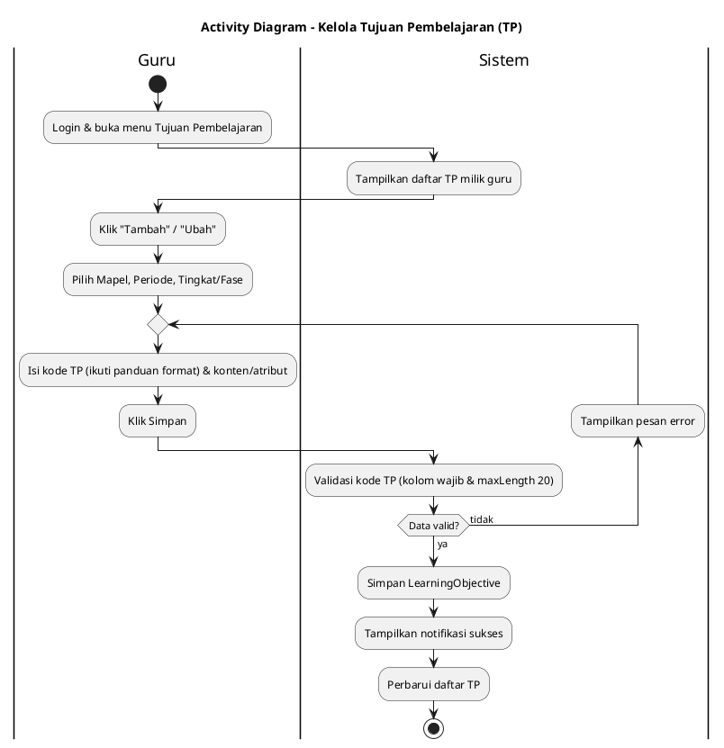
```plantuml
@startuml
title Activity Diagram - Kelola Tujuan Pembelajaran (TP)
|Guru|
start
:Login & buka menu Tujuan Pembelajaran;
|Sistem|
:Tampilkan daftar TP milik guru;
|Guru|
:Klik "Tambah" / "Ubah";
:Pilih Mapel, Periode, Tingkat/Fase;
repeat
  :Isi kode TP (ikuti panduan format) & konten/atribut;
  :Klik Simpan;
  |Sistem|
  :Validasi kode TP (kolom wajib & maxLength 20);
backward:Tampilkan pesan error;
repeat while (Data valid?) is (tidak) not (ya)
:Simpan LearningObjective;
:Tampilkan notifikasi sukses;
:Perbarui daftar TP;
stop
@enduml
```

## 3. Sequence Diagram berbasis MVC (PlantUML)

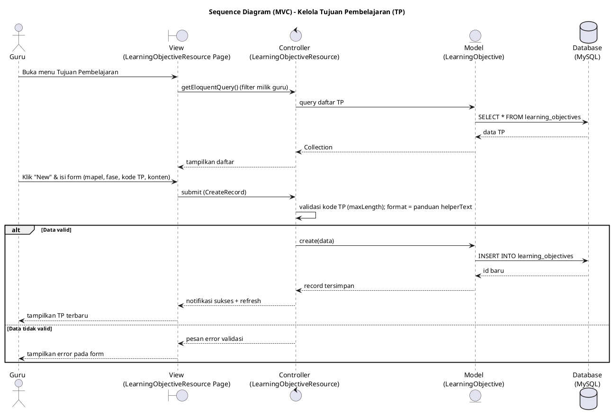
```plantuml
@startuml
title Sequence Diagram (MVC) - Kelola Tujuan Pembelajaran (TP)
actor "Guru" as Guru
boundary "View\n(LearningObjectiveResource Page)" as View
control "Controller\n(LearningObjectiveResource)" as Ctrl
entity "Model\n(LearningObjective)" as Model
database "Database\n(MySQL)" as DB

Guru -> View : Buka menu Tujuan Pembelajaran
View -> Ctrl : getEloquentQuery() (filter milik guru)
Ctrl -> Model : query daftar TP
Model -> DB : SELECT * FROM learning_objectives
DB --> Model : data TP
Model --> Ctrl : Collection
Ctrl --> View : tampilkan daftar

Guru -> View : Klik "New" & isi form (mapel, fase, kode TP, konten)
View -> Ctrl : submit (CreateRecord)
Ctrl -> Ctrl : validasi kode TP (maxLength); format = panduan helperText
alt Data valid
  Ctrl -> Model : create(data)
  Model -> DB : INSERT INTO learning_objectives
  DB --> Model : id baru
  Model --> Ctrl : record tersimpan
  Ctrl --> View : notifikasi sukses + refresh
  View --> Guru : tampilkan TP terbaru
else Data tidak valid
  Ctrl --> View : pesan error validasi
  View --> Guru : tampilkan error pada form
end
@enduml
```

---

# USE CASE 4 — Mengelola Jurnal KBM dan Absensi

## 1. Deskripsi Use Case

| Komponen | Keterangan |
|----------|------------|
| **Nama Use Case** | Mengelola Jurnal KBM dan Absensi |
| **Aktor** | Guru |
| **Deskripsi Singkat** | Guru mencatat jurnal pembelajaran harian (materi/pertemuan) dan mengisi absensi siswa yang terhubung dengan SK Mengajar; sistem merekap kehadiran secara otomatis. |
| **Pre-condition** | Guru login; memiliki SK Mengajar pada periode aktif; siswa terdaftar di kelas terkait. |
| **Post-condition** | Record `LessonJournal` tersimpan; data `attendances` tersimpan; `attendance_summaries` (H/I/S/A + persentase) terbarui otomatis oleh observer. |
| **Skenario Utama (Main Success Scenario)** | 1. Guru membuka menu Jurnal KBM. 2. Guru menekan "New", memilih Kelas & Mapel (SK Mengajar periode aktif). 3. Sistem mengisi nomor pertemuan berikutnya otomatis. 4. Guru mengisi tanggal, topik/materi, catatan, status. 5. Guru menyimpan jurnal. 6. Guru menekan "Isi Absensi" untuk menetapkan status kehadiran tiap siswa. 7. Guru menyimpan absensi. 8. Sistem menyimpan ke `attendances` dan (observer) menghitung ulang rekap ke `attendance_summaries`. 9. Sistem menampilkan notifikasi sukses. |
| **Skenario Alternatif** | 5a. Validasi gagal (tanggal/topik kosong) → sistem menampilkan error. 2a. Tidak ada periode aktif/SK Mengajar → pilihan kosong, jurnal tidak dapat dibuat. |

> Catatan kode: pilihan SK Mengajar difilter ke periode aktif (`whereHas('academicPeriod', is_active=true)`); auto nomor pertemuan via `afterStateUpdated`; rekap absensi otomatis di `AttendanceObserver::recalculate()` (status `holiday` diabaikan).

## 2. Activity Diagram (PlantUML)

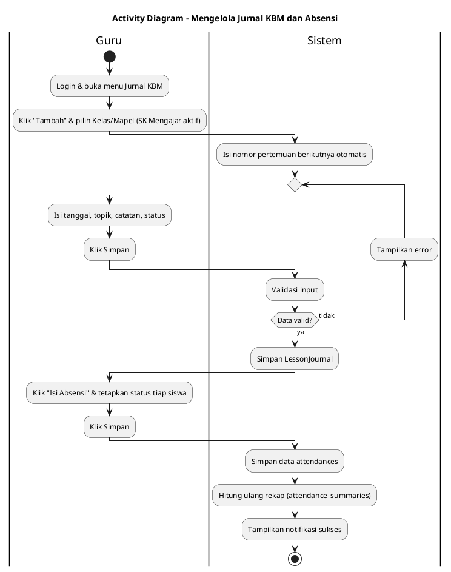
```plantuml
@startuml
title Activity Diagram - Mengelola Jurnal KBM dan Absensi
|Guru|
start
:Login & buka menu Jurnal KBM;
:Klik "Tambah" & pilih Kelas/Mapel (SK Mengajar aktif);
|Sistem|
:Isi nomor pertemuan berikutnya otomatis;
repeat
  |Guru|
  :Isi tanggal, topik, catatan, status;
  :Klik Simpan;
  |Sistem|
  :Validasi input;
backward:Tampilkan error;
repeat while (Data valid?) is (tidak) not (ya)
:Simpan LessonJournal;
|Guru|
:Klik "Isi Absensi" & tetapkan status tiap siswa;
:Klik Simpan;
|Sistem|
:Simpan data attendances;
:Hitung ulang rekap (attendance_summaries);
:Tampilkan notifikasi sukses;
stop
@enduml
```

## 3. Sequence Diagram berbasis MVC (PlantUML)

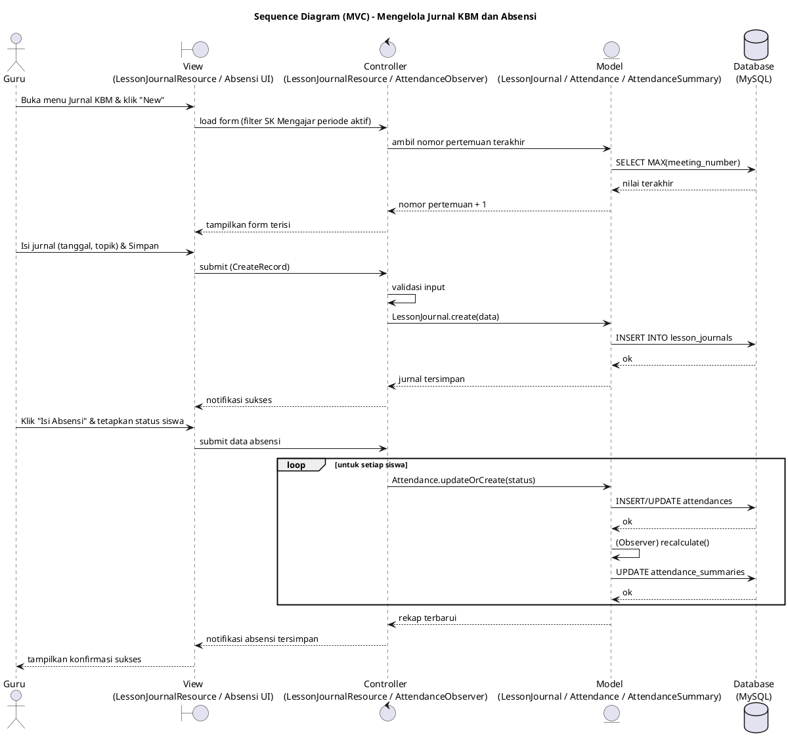
```plantuml
@startuml
title Sequence Diagram (MVC) - Mengelola Jurnal KBM dan Absensi
actor "Guru" as Guru
boundary "View\n(LessonJournalResource / Absensi UI)" as View
control "Controller\n(LessonJournalResource / AttendanceObserver)" as Ctrl
entity "Model\n(LessonJournal / Attendance / AttendanceSummary)" as Model
database "Database\n(MySQL)" as DB

Guru -> View : Buka menu Jurnal KBM & klik "New"
View -> Ctrl : load form (filter SK Mengajar periode aktif)
Ctrl -> Model : ambil nomor pertemuan terakhir
Model -> DB : SELECT MAX(meeting_number)
DB --> Model : nilai terakhir
Model --> Ctrl : nomor pertemuan + 1
Ctrl --> View : tampilkan form terisi

Guru -> View : Isi jurnal (tanggal, topik) & Simpan
View -> Ctrl : submit (CreateRecord)
Ctrl -> Ctrl : validasi input
Ctrl -> Model : LessonJournal.create(data)
Model -> DB : INSERT INTO lesson_journals
DB --> Model : ok
Model --> Ctrl : jurnal tersimpan
Ctrl --> View : notifikasi sukses

Guru -> View : Klik "Isi Absensi" & tetapkan status siswa
View -> Ctrl : submit data absensi
loop untuk setiap siswa
  Ctrl -> Model : Attendance.updateOrCreate(status)
  Model -> DB : INSERT/UPDATE attendances
  DB --> Model : ok
  Model -> Model : (Observer) recalculate()
  Model -> DB : UPDATE attendance_summaries
  DB --> Model : ok
end
Model --> Ctrl : rekap terbarui
Ctrl --> View : notifikasi absensi tersimpan
View --> Guru : tampilkan konfirmasi sukses
@enduml
```

---

# USE CASE 5 — Input Nilai Sumatif/Formatif & Hitung Nilai Akhir

## 1. Deskripsi Use Case

| Komponen | Keterangan |
|----------|------------|
| **Nama Use Case** | Input Nilai Sumatif/Formatif & Hitung Nilai Akhir |
| **Aktor** | Guru (pengampu SK Mengajar) |
| **Deskripsi Singkat** | Guru merancang asesmen (formatif/sumatif), menginput nilai per siswa, lalu sistem otomatis menghitung Nilai Akhir dan predikat (A–E) sebagai snapshot rapor. |
| **Pre-condition** | Guru login; memiliki SK Mengajar (`TeachingAssignment`) aktif; siswa sudah terdaftar (`enrollment`) di kelas terkait. |
| **Post-condition** | Nilai tersimpan di tabel `grades`; `FinalGrade` (final_score + grade_label) terhitung/terbarui per siswa per semester. |
| **Skenario Utama (Main Success Scenario)** | 1. Guru membuka SK Mengajar → tab "Rencana & Input Nilai". 2. Guru membuat asesmen (kategori, teknik, bobot, kaitan TP). 3. Sistem memvalidasi total bobot sumatif ≤ 100% (pada formula *weighting*). 4. Guru membuka "Input Nilai", mengisi nilai tiap siswa. 5. Guru menyimpan. 6. Sistem menyimpan nilai ke `grades`. 7. Sistem memanggil `calculateFinalGrade()` per siswa sesuai `grading_formula` (average/weighting/percentage). 8. Sistem me-*resolve* predikat A–E via `GradeRangeResolver`. 9. Sistem menyimpan hasil ke `FinalGrade` dan menampilkan notifikasi sukses. |
| **Skenario Alternatif** | 3a. Total bobot > 100% → sistem menampilkan error & membatalkan simpan (`action()->halt()`). 7a. Belum ada nilai sumatif → nilai akhir bernilai 0/null (tidak menghasilkan predikat). |

> Catatan kode: alur merujuk pada `AssessmentsRelationManager` (action `input_grades`, validasi bobot `before()`), `TeachingAssignment::calculateFinalGrade()`, `GradeRangeResolver::resolve()`, dan model `FinalGrade`. Sesuai scope tesis, cabang remedial dikecualikan.

## 2. Activity Diagram (PlantUML)

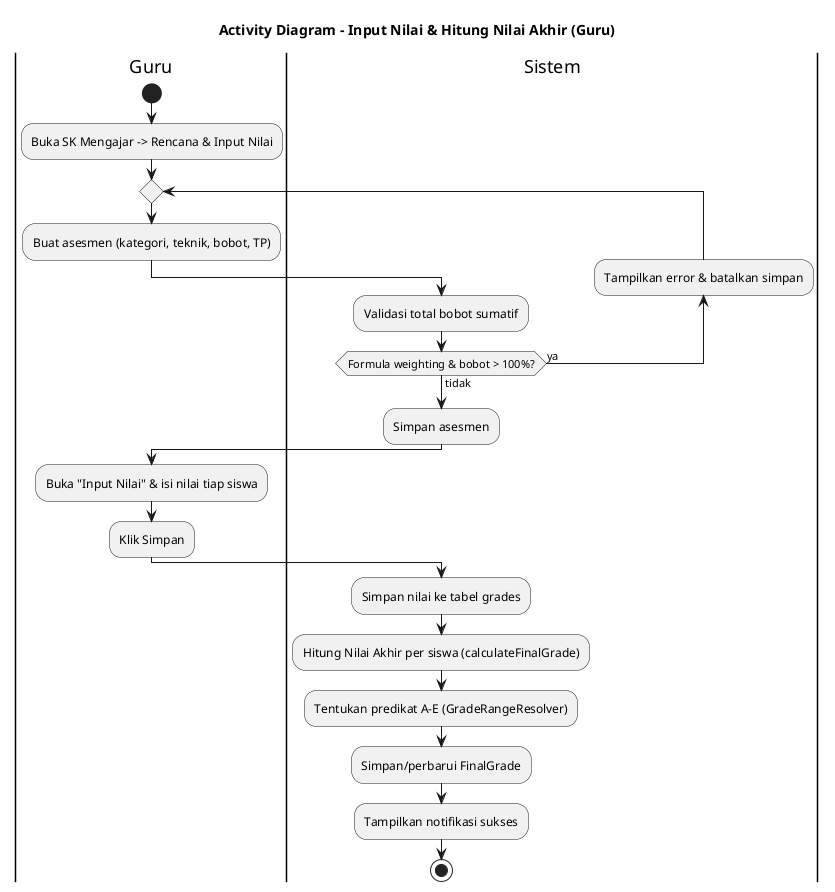
```plantuml
@startuml
title Activity Diagram - Input Nilai & Hitung Nilai Akhir (Guru)
|Guru|
start
:Buka SK Mengajar -> Rencana & Input Nilai;
repeat
  :Buat asesmen (kategori, teknik, bobot, TP);
  |Sistem|
  :Validasi total bobot sumatif;
backward:Tampilkan error & batalkan simpan;
repeat while (Formula weighting & bobot > 100%?) is (ya) not (tidak)
:Simpan asesmen;
|Guru|
:Buka "Input Nilai" & isi nilai tiap siswa;
:Klik Simpan;
|Sistem|
:Simpan nilai ke tabel grades;
:Hitung Nilai Akhir per siswa (calculateFinalGrade);
:Tentukan predikat A-E (GradeRangeResolver);
:Simpan/perbarui FinalGrade;
:Tampilkan notifikasi sukses;
stop
@enduml
```

## 3. Sequence Diagram berbasis MVC (PlantUML)

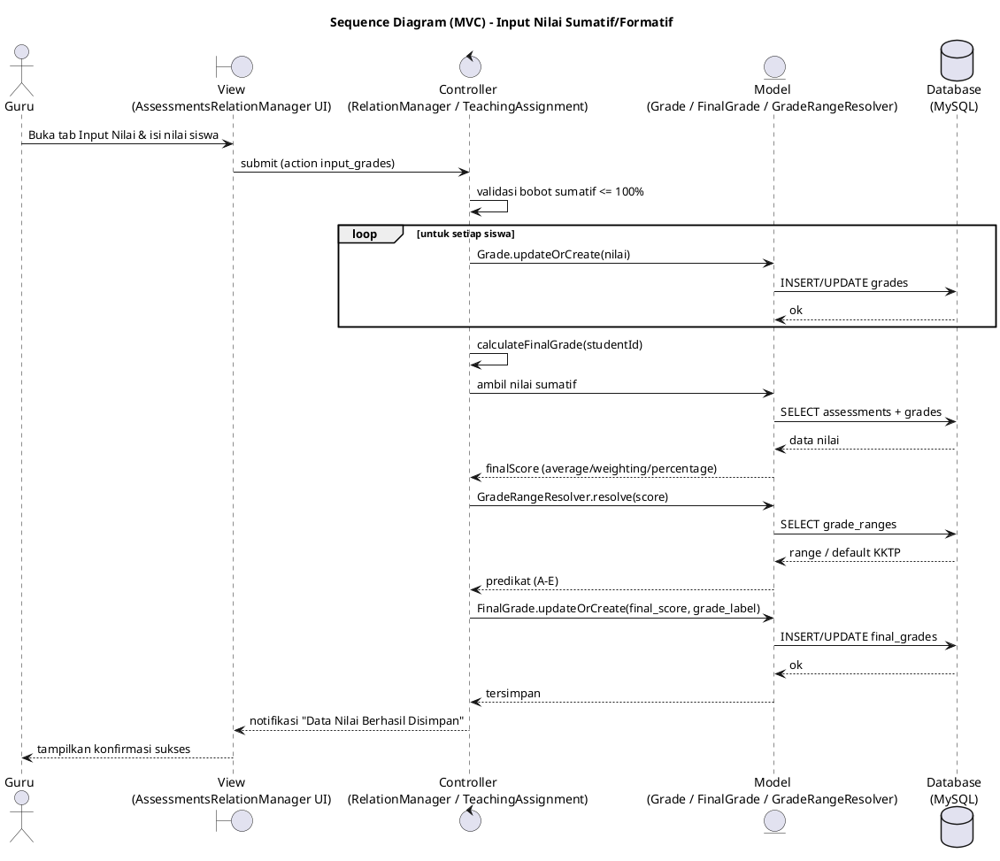
```plantuml
@startuml
title Sequence Diagram (MVC) - Input Nilai Sumatif/Formatif
actor "Guru" as Guru
boundary "View\n(AssessmentsRelationManager UI)" as View
control "Controller\n(RelationManager / TeachingAssignment)" as Ctrl
entity "Model\n(Grade / FinalGrade / GradeRangeResolver)" as Model
database "Database\n(MySQL)" as DB

Guru -> View : Buka tab Input Nilai & isi nilai siswa
View -> Ctrl : submit (action input_grades)
Ctrl -> Ctrl : validasi bobot sumatif <= 100%

loop untuk setiap siswa
  Ctrl -> Model : Grade.updateOrCreate(nilai)
  Model -> DB : INSERT/UPDATE grades
  DB --> Model : ok
end

Ctrl -> Ctrl : calculateFinalGrade(studentId)
Ctrl -> Model : ambil nilai sumatif
Model -> DB : SELECT assessments + grades
DB --> Model : data nilai
Model --> Ctrl : finalScore (average/weighting/percentage)

Ctrl -> Model : GradeRangeResolver.resolve(score)
Model -> DB : SELECT grade_ranges
DB --> Model : range / default KKTP
Model --> Ctrl : predikat (A-E)

Ctrl -> Model : FinalGrade.updateOrCreate(final_score, grade_label)
Model -> DB : INSERT/UPDATE final_grades
DB --> Model : ok
Model --> Ctrl : tersimpan
Ctrl --> View : notifikasi "Data Nilai Berhasil Disimpan"
View --> Guru : tampilkan konfirmasi sukses
@enduml
```

---

# USE CASE 6 — Kunci dan Cetak Rapor

## 1. Deskripsi Use Case

| Komponen | Keterangan |
|----------|------------|
| **Nama Use Case** | Kunci dan Cetak Rapor |
| **Aktor** | Guru (sebagai Wali Kelas) / Admin |
| **Deskripsi Singkat** | Wali Kelas melengkapi catatan & rekap absensi rapor (`StudentReport`), (opsional) men-*generate* narasi deskripsi rapor via `DescriptionGeneratorService`, mengunci nilai akhir agar tidak berubah (`is_locked = true`), lalu mencetak rapor melalui `RaporPrintController` yang merakit data via `RaporExportService` dan merendernya ke `print.blade.php`. |
| **Pre-condition** | Aktor login; merupakan Wali Kelas aktif pada kelas/periode aktif (atau Admin); nilai akhir siswa (`FinalGrade`) sudah terisi. |
| **Post-condition** | Catatan & absensi tersimpan di `student_reports`; narasi tersimpan di `FinalGrade.narrative_description`; `FinalGrade` terkunci (`is_locked = true`, `locked_at` terisi); dokumen rapor ter-*render* untuk dicetak. |
| **Skenario Utama (Main Success Scenario)** | 1. Aktor membuka halaman Rekap Rapor → ViewRapor. 2. Aktor menekan "Input Catatan & Absensi", mengisi catatan wali kelas + S/I/A per siswa. 3. Sistem menyimpan ke `StudentReport`. 4. *(Opsional)* Aktor menekan "Generate Semua Deskripsi". 5. Sistem men-*generate* narasi via `DescriptionGeneratorService` & menyimpannya ke `FinalGrade.narrative_description`, **melewati siswa yang `is_locked = true`**. 6. Aktor me-*review* narasi, lalu menekan "Kunci Semua Nilai". 7. Sistem menetapkan `is_locked = true` pada `FinalGrade` terkait. 8. Aktor memilih siswa dan menekan "Cetak Rapor". 9. View memanggil `RaporPrintController` (membuka tab baru). 10. Controller meminta agregasi data ke `RaporExportService::getRaporData()` (termasuk `narrative_description`). 11. Controller menimpa absensi/catatan dari `StudentReport`, lalu merender `print.blade.php`. |
| **Skenario Alternatif** | 2a. Validasi catatan/absensi gagal → sistem menampilkan error & mengulang input. 5a. Siswa sudah `is_locked` → narasi siswa tsb dilewati (tidak ditimpa). 7a. Nilai sudah terkunci → input nilai oleh guru mapel diabaikan (observer berhenti). |

> Catatan kode: action `input_homeroom_notes` → `StudentReport::updateOrCreate`; action `generate_narasi` → `DescriptionGeneratorService::generate()` → `FinalGrade::updateOrCreate(['narrative_description' => ...])`; action `kunci_semua` → `FinalGrade ... update(['is_locked'=>true,'locked_at'=>now()])`; action `cetak_rapor` → `route('rapor.print')` (window.open) → `RaporPrintController::show` → `RaporExportService::getRaporData` → `view('rapor.print')`. Pada kode, action kunci tersedia untuk `super_admin/admin/headmaster`; input catatan & generate untuk `super_admin/admin/teacher`.
>
> ⚠️ **Catatan to-be:** Langkah 5 (melewati siswa `is_locked`) menggambarkan **perilaku target setelah perbaikan**. Pada kode saat ini, `ViewRapor::generate_narasi` belum mengecek `is_locked` (berbeda dengan `ViewGradebook` yang sudah menghormatinya). Diagram ini mengacu pada alur yang akan diselaraskan.

## 2. Activity Diagram (PlantUML)

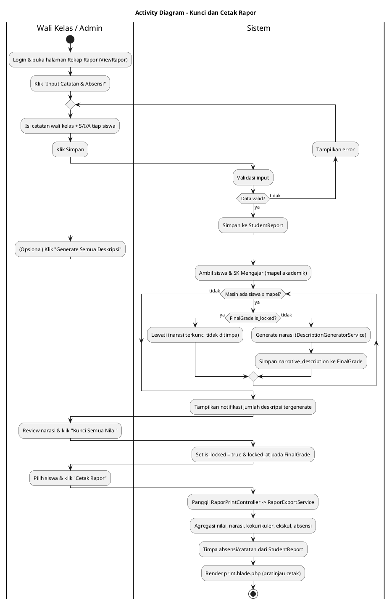
```plantuml
@startuml
title Activity Diagram - Kunci dan Cetak Rapor
|Wali Kelas / Admin|
start
:Login & buka halaman Rekap Rapor (ViewRapor);
:Klik "Input Catatan & Absensi";
repeat
  :Isi catatan wali kelas + S/I/A tiap siswa;
  :Klik Simpan;
  |Sistem|
  :Validasi input;
backward:Tampilkan error;
repeat while (Data valid?) is (tidak) not (ya)
:Simpan ke StudentReport;
|Wali Kelas / Admin|
:(Opsional) Klik "Generate Semua Deskripsi";
|Sistem|
:Ambil siswa & SK Mengajar (mapel akademik);
while (Masih ada siswa x mapel?) is (ya)
  if (FinalGrade is_locked?) then (ya)
    :Lewati (narasi terkunci tidak ditimpa);
  else (tidak)
    :Generate narasi (DescriptionGeneratorService);
    :Simpan narrative_description ke FinalGrade;
  endif
endwhile (tidak)
:Tampilkan notifikasi jumlah deskripsi tergenerate;
|Wali Kelas / Admin|
:Review narasi & klik "Kunci Semua Nilai";
|Sistem|
:Set is_locked = true & locked_at pada FinalGrade;
|Wali Kelas / Admin|
:Pilih siswa & klik "Cetak Rapor";
|Sistem|
:Panggil RaporPrintController -> RaporExportService;
:Agregasi nilai, narasi, kokurikuler, ekskul, absensi;
:Timpa absensi/catatan dari StudentReport;
:Render print.blade.php (pratinjau cetak);
stop
@enduml
```

## 3. Sequence Diagram berbasis MVC (PlantUML)

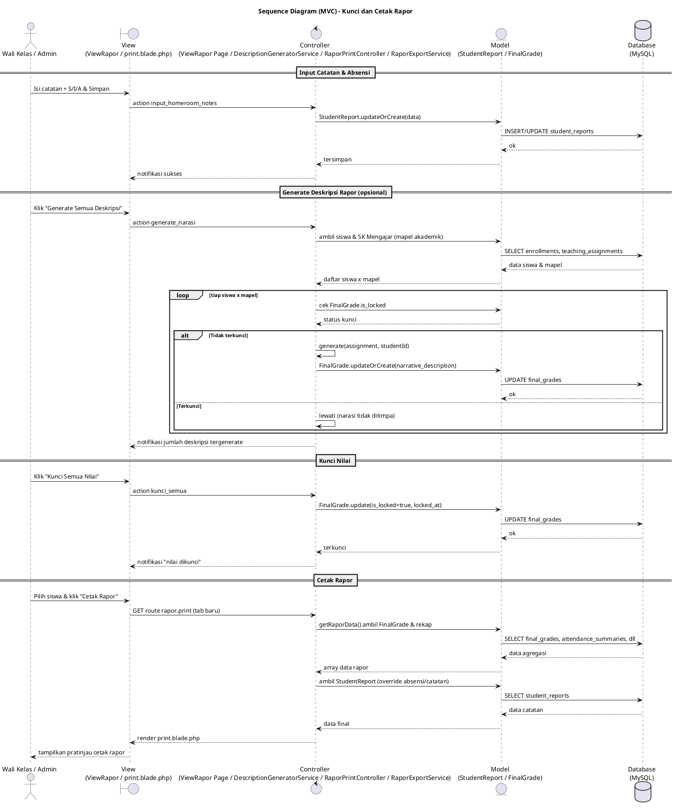
```plantuml
@startuml
title Sequence Diagram (MVC) - Kunci dan Cetak Rapor
actor "Wali Kelas / Admin" as User
boundary "View\n(ViewRapor / print.blade.php)" as View
control "Controller\n(ViewRapor Page / DescriptionGeneratorService / RaporPrintController / RaporExportService)" as Ctrl
entity "Model\n(StudentReport / FinalGrade)" as Model
database "Database\n(MySQL)" as DB

== Input Catatan & Absensi ==
User -> View : Isi catatan + S/I/A & Simpan
View -> Ctrl : action input_homeroom_notes
Ctrl -> Model : StudentReport.updateOrCreate(data)
Model -> DB : INSERT/UPDATE student_reports
DB --> Model : ok
Model --> Ctrl : tersimpan
Ctrl --> View : notifikasi sukses

== Generate Deskripsi Rapor (opsional) ==
User -> View : Klik "Generate Semua Deskripsi"
View -> Ctrl : action generate_narasi
Ctrl -> Model : ambil siswa & SK Mengajar (mapel akademik)
Model -> DB : SELECT enrollments, teaching_assignments
DB --> Model : data siswa & mapel
Model --> Ctrl : daftar siswa x mapel
loop tiap siswa x mapel
  Ctrl -> Model : cek FinalGrade.is_locked
  Model --> Ctrl : status kunci
  alt Tidak terkunci
    Ctrl -> Ctrl : generate(assignment, studentId)
    Ctrl -> Model : FinalGrade.updateOrCreate(narrative_description)
    Model -> DB : UPDATE final_grades
    DB --> Model : ok
  else Terkunci
    Ctrl -> Ctrl : lewati (narasi tidak ditimpa)
  end
end
Ctrl --> View : notifikasi jumlah deskripsi tergenerate

== Kunci Nilai ==
User -> View : Klik "Kunci Semua Nilai"
View -> Ctrl : action kunci_semua
Ctrl -> Model : FinalGrade.update(is_locked=true, locked_at)
Model -> DB : UPDATE final_grades
DB --> Model : ok
Model --> Ctrl : terkunci
Ctrl --> View : notifikasi "nilai dikunci"

== Cetak Rapor ==
User -> View : Pilih siswa & klik "Cetak Rapor"
View -> Ctrl : GET route rapor.print (tab baru)
Ctrl -> Model : getRaporData() ambil FinalGrade & rekap
Model -> DB : SELECT final_grades, attendance_summaries, dll
DB --> Model : data agregasi
Model --> Ctrl : array data rapor
Ctrl -> Model : ambil StudentReport (override absensi/catatan)
Model -> DB : SELECT student_reports
DB --> Model : data catatan
Model --> Ctrl : data final
Ctrl --> View : render print.blade.php
View --> User : tampilkan pratinjau cetak rapor
@enduml
```

---

# USE CASE 7 — Memantau Kinerja Penilaian Guru

## 1. Deskripsi Use Case

| Komponen | Keterangan |
|----------|------------|
| **Nama Use Case** | Memantau Kinerja Penilaian Guru |
| **Aktor** | Kepala Sekolah |
| **Deskripsi Singkat** | Kepala Sekolah mengakses dasbor/widget secara *read-only* untuk memantau metrik kinerja penilaian (kelengkapan input nilai per guru, jumlah jurnal), hasil agregasi oleh `NilaiVisualisasiService::getKinerjaGuru()` atas `TeachingAssignment`, `FinalGrade`, dan `lessonJournals`. |
| **Pre-condition** | Kepala Sekolah login; memiliki akses pemantauan (read-only); data penugasan & nilai akhir sudah ada. |
| **Post-condition** | Metrik/grafik kinerja ditampilkan. **Tidak ada perubahan data** (operasi murni baca). |
| **Skenario Utama (Main Success Scenario)** | 1. Kepala Sekolah login dan membuka Dasbor. 2. Sistem memuat widget pemantauan (`KinerjaGuruWidget`). 3. Widget **mendelegasikan** ke `NilaiVisualisasiService::getKinerjaGuru()` yang mengagregasi `TeachingAssignment` (mapel wajib, periode aktif), `FinalGrade`, jumlah `lessonJournals`, dan jumlah siswa (`Enrollment`). 4. Service menghitung metrik (persentase kelengkapan nilai, jumlah jurnal, status Lengkap/Sebagian/Belum). 5. Service mengembalikan array ke widget. 6. View merender tabel metrik. 7. Kepala Sekolah meninjau data. |
| **Skenario Alternatif** | 3a. Belum ada periode aktif / data nilai → service mengembalikan data kosong (nilai 0). 2a. Aktor mencoba aksi tulis → ditolak (widget read-only, `canView` hanya `headmaster`/`super_admin`). |

> Catatan kode: `KinerjaGuruWidget` (`canView()` dibatasi `headmaster`/`super_admin`) & `RingkasanNilaiKelasWidget` memanggil **`NilaiVisualisasiService`** — masing-masing `getKinerjaGuru()` (kelengkapan nilai = total nilai terisi ÷ total siswa, jumlah jurnal, status) dan `getRingkasanNilaiKelas()` (rata-rata/min/maks per mapel). Peran `headmaster` di seeder bersifat read-only (`view_*`).

## 2. Activity Diagram (PlantUML)

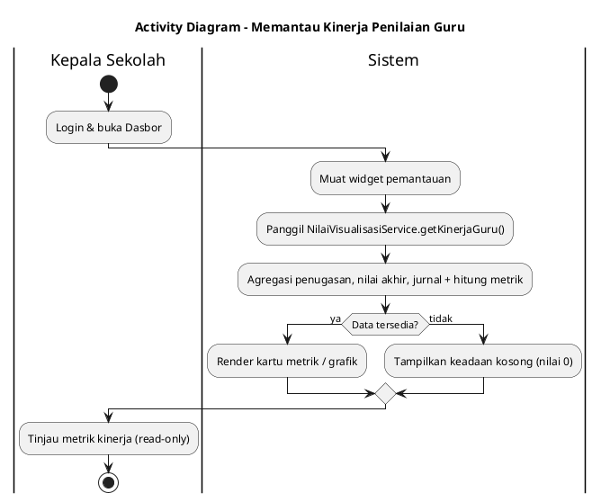
```plantuml
@startuml
title Activity Diagram - Memantau Kinerja Penilaian Guru
|Kepala Sekolah|
start
:Login & buka Dasbor;
|Sistem|
:Muat widget pemantauan;
:Panggil NilaiVisualisasiService.getKinerjaGuru();
:Agregasi penugasan, nilai akhir, jurnal + hitung metrik;
if (Data tersedia?) then (ya)
  :Render kartu metrik / grafik;
else (tidak)
  :Tampilkan keadaan kosong (nilai 0);
endif
|Kepala Sekolah|
:Tinjau metrik kinerja (read-only);
stop
@enduml
```

## 3. Sequence Diagram berbasis MVC (PlantUML)

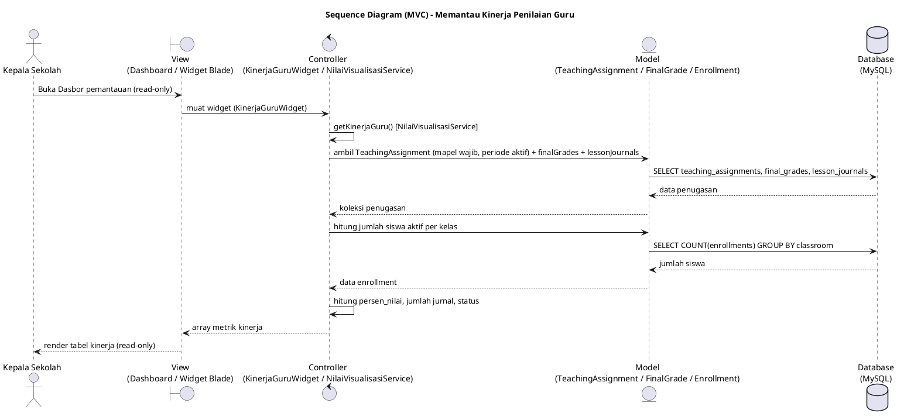
```plantuml
@startuml
title Sequence Diagram (MVC) - Memantau Kinerja Penilaian Guru
actor "Kepala Sekolah" as KS
boundary "View\n(Dashboard / Widget Blade)" as View
control "Controller\n(KinerjaGuruWidget / NilaiVisualisasiService)" as Ctrl
entity "Model\n(TeachingAssignment / FinalGrade / Enrollment)" as Model
database "Database\n(MySQL)" as DB

KS -> View : Buka Dasbor pemantauan (read-only)
View -> Ctrl : muat widget (KinerjaGuruWidget)
Ctrl -> Ctrl : getKinerjaGuru() [NilaiVisualisasiService]
Ctrl -> Model : ambil TeachingAssignment (mapel wajib, periode aktif) + finalGrades + lessonJournals
Model -> DB : SELECT teaching_assignments, final_grades, lesson_journals
DB --> Model : data penugasan
Model --> Ctrl : koleksi penugasan

Ctrl -> Model : hitung jumlah siswa aktif per kelas
Model -> DB : SELECT COUNT(enrollments) GROUP BY classroom
DB --> Model : jumlah siswa
Model --> Ctrl : data enrollment

Ctrl -> Ctrl : hitung persen_nilai, jumlah jurnal, status
Ctrl --> View : array metrik kinerja
View --> KS : render tabel kinerja (read-only)
@enduml
```

---

# USE CASE 8 — Memantau Perkembangan Akademik

## 1. Deskripsi Use Case

| Komponen | Keterangan |
|----------|------------|
| **Nama Use Case** | Memantau Perkembangan Akademik |
| **Aktor** | Siswa dan Orang Tua (Wali Siswa) |
| **Deskripsi Singkat** | Aktor melihat data akademik historis (nilai akhir, rincian formatif/sumatif, rekap kehadiran) dan rapor versi bayangan (*unofficial*) secara *read-only*, dengan data difilter ketat menurut sesi login. |
| **Pre-condition** | Aktor login; Siswa memiliki profil `Student` (relasi via `user_id`); Orang Tua tertaut ke siswa via `guardian_user_id`; siswa memiliki `enrollment` aktif. |
| **Post-condition** | Data akademik milik siswa terkait ditampilkan dalam mode baca; rapor yang dicetak ditandai *unofficial* (`isOfficial = false`). **Tidak ada perubahan data.** |
| **Skenario Utama (Main Success Scenario)** | 1. Aktor login & membuka menu "Detail Nilai Saya" / Rekap Rapor. 2. Controller mengidentifikasi siswa dari sesi (Siswa = `Auth::user()->student`; Orang Tua = `guardianStudents`). 3. Aktor memilih semester/tahun ajaran. 4. Controller mengambil `enrollment` aktif siswa pada periode tsb. 5. Controller meminta nilai akhir (`FinalGrade`), rincian nilai (`Grade`), dan rekap kehadiran (`AttendanceSummary`). 6. Sistem menyusun data akademik vs kokurikuler. 7. View merender tampilan perkembangan (read-only). 8. (Opsional) Aktor mencetak rapor bayangan → ditandai *unofficial*. |
| **Skenario Alternatif** | 4a. Tidak ada enrollment di periode terpilih → tampilkan "data belum tersedia". 2a. Aktor tanpa keterkaitan siswa → akses ditolak. |

> Catatan kode: `MyGrades::canAccess()` & `getViewData()` memfilter berdasarkan `Auth::user()->student` lalu mengambil `FinalGrade`, `Grade`, `AttendanceSummary`. `RaporExportService::getRaporData()` menetapkan `isOfficial = false` bila peran `student/guardian`. Penyaringan pilihan siswa pada aksi cetak menggunakan `nisn`.

## 2. Activity Diagram (PlantUML)

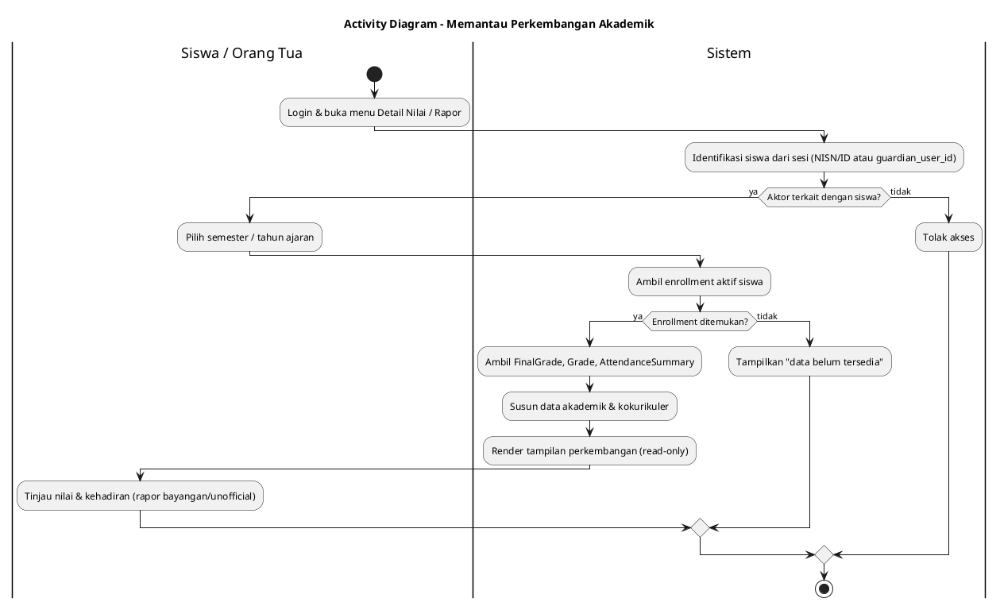
```plantuml
@startuml
title Activity Diagram - Memantau Perkembangan Akademik
|Siswa / Orang Tua|
start
:Login & buka menu Detail Nilai / Rapor;
|Sistem|
:Identifikasi siswa dari sesi (NISN/ID atau guardian_user_id);
if (Aktor terkait dengan siswa?) then (ya)
  |Siswa / Orang Tua|
  :Pilih semester / tahun ajaran;
  |Sistem|
  :Ambil enrollment aktif siswa;
  if (Enrollment ditemukan?) then (ya)
    :Ambil FinalGrade, Grade, AttendanceSummary;
    :Susun data akademik & kokurikuler;
    :Render tampilan perkembangan (read-only);
    |Siswa / Orang Tua|
    :Tinjau nilai & kehadiran (rapor bayangan/unofficial);
  else (tidak)
    |Sistem|
    :Tampilkan "data belum tersedia";
  endif
else (tidak)
  |Sistem|
  :Tolak akses;
endif
stop
@enduml
```

## 3. Sequence Diagram berbasis MVC (PlantUML)

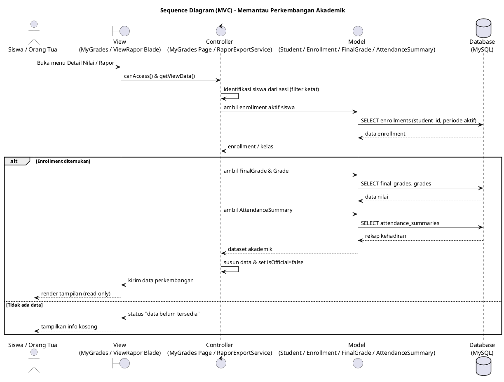
```plantuml
@startuml
title Sequence Diagram (MVC) - Memantau Perkembangan Akademik
actor "Siswa / Orang Tua" as User
boundary "View\n(MyGrades / ViewRapor Blade)" as View
control "Controller\n(MyGrades Page / RaporExportService)" as Ctrl
entity "Model\n(Student / Enrollment / FinalGrade / AttendanceSummary)" as Model
database "Database\n(MySQL)" as DB

User -> View : Buka menu Detail Nilai / Rapor
View -> Ctrl : canAccess() & getViewData()
Ctrl -> Ctrl : identifikasi siswa dari sesi (filter ketat)
Ctrl -> Model : ambil enrollment aktif siswa
Model -> DB : SELECT enrollments (student_id, periode aktif)
DB --> Model : data enrollment
Model --> Ctrl : enrollment / kelas

alt Enrollment ditemukan
  Ctrl -> Model : ambil FinalGrade & Grade
  Model -> DB : SELECT final_grades, grades
  DB --> Model : data nilai
  Ctrl -> Model : ambil AttendanceSummary
  Model -> DB : SELECT attendance_summaries
  DB --> Model : rekap kehadiran
  Model --> Ctrl : dataset akademik
  Ctrl -> Ctrl : susun data & set isOfficial=false
  Ctrl --> View : kirim data perkembangan
  View --> User : render tampilan (read-only)
else Tidak ada data
  Ctrl --> View : status "data belum tersedia"
  View --> User : tampilkan info kosong
end
@enduml
```

---

# USE CASE 9 — Login

## 1. Deskripsi Use Case

| Komponen | Keterangan |
|----------|------------|
| **Nama Use Case** | Login |
| **Aktor** | Semua Aktor (Admin, Guru/Wali Kelas, Kepala Sekolah, Siswa, Orang Tua) |
| **Deskripsi Singkat** | Aktor masuk ke sistem dengan kredensial fleksibel (Username/NISN/NIP atau Email). Sistem memvalidasi kredensial, memastikan akun aktif (`is_active = true`), memeriksa Role (Spatie), lalu mengarahkan ke dasbor sesuai peran. |
| **Pre-condition** | Aktor memiliki akun `User` yang terdaftar; aktor belum terautentikasi. |
| **Post-condition** | Sesi terautentikasi terbentuk; aktor diarahkan ke dasbor sesuai Role. Bila gagal, sistem menampilkan pesan error tanpa membuat sesi. |
| **Skenario Utama (Main Success Scenario)** | 1. Aktor membuka halaman Login. 2. Aktor memasukkan login (NISN/NIP/Email) + password. 3. Controller mendeteksi tipe login (mengandung "@" → email, selain itu → username). 4. Controller mencocokkan kredensial ke Model `User`. 5. Sistem memvalidasi `is_active == true` (`canAccessPanel`). 6. Sistem memeriksa Role pengguna (Spatie Permission). 7. Sistem membuat sesi dan mengarahkan ke dasbor sesuai peran. |
| **Skenario Alternatif** | 4a. Kredensial salah → `throwFailureValidationException`, tampilkan error. 5a. `is_active = false` → akses panel ditolak. |

> Catatan kode: `App\Filament\Pages\Auth\Login::getCredentialsFromFormData()` mendeteksi email vs username; `User::canAccessPanel()` mengembalikan `is_active`; Role dikelola Spatie (`HasRoles`). Penentuan menu/dasbor mengikuti hak akses & navigasi per-resource berbasis role.

## 2. Activity Diagram (PlantUML)

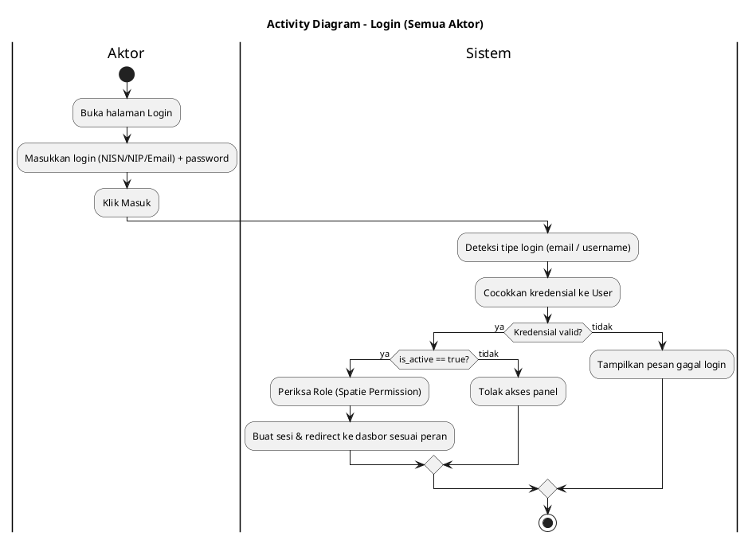
```plantuml
@startuml
title Activity Diagram - Login (Semua Aktor)
|Aktor|
start
:Buka halaman Login;
:Masukkan login (NISN/NIP/Email) + password;
:Klik Masuk;
|Sistem|
:Deteksi tipe login (email / username);
:Cocokkan kredensial ke User;
if (Kredensial valid?) then (ya)
  if (is_active == true?) then (ya)
    :Periksa Role (Spatie Permission);
    :Buat sesi & redirect ke dasbor sesuai peran;
  else (tidak)
    :Tolak akses panel;
  endif
else (tidak)
  :Tampilkan pesan gagal login;
endif
stop
@enduml
```

## 3. Sequence Diagram berbasis MVC (PlantUML)

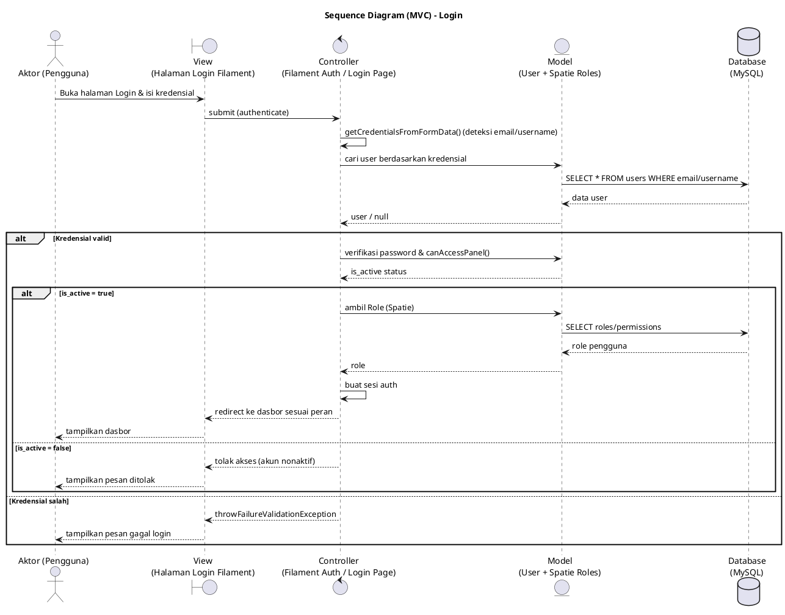
```plantuml
@startuml
title Sequence Diagram (MVC) - Login
actor "Aktor (Pengguna)" as User
boundary "View\n(Halaman Login Filament)" as View
control "Controller\n(Filament Auth / Login Page)" as Ctrl
entity "Model\n(User + Spatie Roles)" as Model
database "Database\n(MySQL)" as DB

User -> View : Buka halaman Login & isi kredensial
View -> Ctrl : submit (authenticate)
Ctrl -> Ctrl : getCredentialsFromFormData() (deteksi email/username)
Ctrl -> Model : cari user berdasarkan kredensial
Model -> DB : SELECT * FROM users WHERE email/username
DB --> Model : data user
Model --> Ctrl : user / null

alt Kredensial valid
  Ctrl -> Model : verifikasi password & canAccessPanel()
  Model --> Ctrl : is_active status
  alt is_active = true
    Ctrl -> Model : ambil Role (Spatie)
    Model -> DB : SELECT roles/permissions
    DB --> Model : role pengguna
    Model --> Ctrl : role
    Ctrl -> Ctrl : buat sesi auth
    Ctrl --> View : redirect ke dasbor sesuai peran
    View --> User : tampilkan dasbor
  else is_active = false
    Ctrl --> View : tolak akses (akun nonaktif)
    View --> User : tampilkan pesan ditolak
  end
else Kredensial salah
  Ctrl --> View : throwFailureValidationException
  View --> User : tampilkan pesan gagal login
end
@enduml
```

---

## Catatan Kesesuaian Kode (untuk akurasi dokumentasi)

- **UC6:** Pada implementasi nyata, aksi **"Kunci Semua Nilai"** divisibilitas untuk `super_admin/admin/headmaster` (bukan `teacher`), sementara **input catatan wali kelas** terbuka untuk `super_admin/admin/teacher`. Alur didokumentasikan sesuai narasi (Wali Kelas/Admin) dengan menandai perbedaan otorisasi ini.
- **UC6 — Generate Deskripsi:** Diagram menggambarkan alur **to-be** di mana generate **melewati siswa `is_locked`**. Saat ini `ViewRapor::generate_narasi` belum mengecek `is_locked` (menimpa semua), sedangkan `ViewGradebook::generate_narasi` sudah menghormatinya (`if ($finalGrade->is_locked) continue;`). Perbaikan akan menyelaraskan `ViewRapor` agar konsisten. Langkah generate tetap **digabung di dalam UC6** (bukan use case terpisah); pada Use Case Diagram induk dapat ditampilkan sebagai relasi `<<extend>>` ("Generate Deskripsi Rapor").
- **UC8:** Halaman `MyGrades` membatasi `canAccess()` ke peran **`student`**; jalur Orang Tua/Wali memakai relasi `guardian_user_id` (`User::guardianStudents()`) dan tampil sebagai rapor bayangan (`isOfficial = false`).
- **UC3:** Format kode TP **tidak distandarkan/divalidasi otomatis** oleh kode — hanya `maxLength(20)` + `helperText` panduan (`[KODE_MAPEL]-[KELAS]-[SEMESTER]-[NOMOR]`). Diagram & narasi memakai istilah "panduan format (konvensi)".
- **UC7:** Agregasi metrik dilakukan oleh **`NilaiVisualisasiService`** (`getKinerjaGuru()` / `getRingkasanNilaiKelas()`), bukan kueri langsung di widget; `KinerjaGuruWidget::canView()` dibatasi `headmaster`/`super_admin`.
- **UC9:** Validasi `is_active` berada di `User::canAccessPanel()`. Terdapat catatan historis bahwa penamaan role di sebagian kode tidak selalu konsisten (slug `guardian` vs string `wali_siswa`); untuk dokumentasi formal digunakan mekanisme Spatie `HasRoles`.
